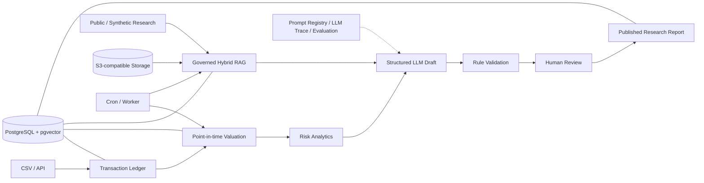

# PortfolioPilot

[](https://github.com/xjy0526/PortfolioPilot/actions/workflows/ci.yml?query=branch%3Amain+event%3Apush)
[](https://github.com/xjy0526/PortfolioPilot/actions/workflows/ci.yml?query=event%3Apull_request)

PortfolioPilot 是一个面向基金投研场景的可追溯 AI 工作流平台：以 PostgreSQL 交易账本和时点估值生成确定性组合风险结果，通过受治理的 Hybrid RAG 检索可引用证据，并结合 Prompt/LLM Trace、规则校验与人工审核生成可复核研究报告。

项目用于金融研究与工程能力展示，不连接券商、不执行真实交易，也不构成投资建议、合规认证或收益承诺。

## 三个核心差异点

| 差异点 | PortfolioPilot 如何实现 |
|---|---|
| **Point-in-time ledger and valuation** | `transactions` 是持仓事实源；按统一 `as_of` 重建证券与现金，并关联当时可得的 PriceBar、历史 FX 和数据 lineage |
| **Governed hybrid RAG and citation lineage** | 先做权限、版本和有效期过滤，再融合 PostgreSQL FTS、pgvector 与 RRF；引用可回溯到 document/version/chunk |
| **Deterministic validation plus human review** | 风险与权重由确定性模块计算；LLM 草稿必须通过数字、引用和规则校验，之后才能进入人工审核与发布 |

## 简化架构



## 最快体验入口

无需真实 API Key，也不需要外部账户。下面的 `synthetic_smoke` 只验证离线工程链路；输出会明确标记 mock、数据集版本和人工标注数量，不代表真实模型质量。

```bash
python3 -m venv venv
source venv/bin/activate
python -m pip install -r requirements.txt
python -m evaluation.run_v2_eval \
  --mode synthetic_smoke \
  --output cache/evaluation/v2/synthetic_smoke/quickstart.json
```

查看报告 provenance：

```bash
python -c "import json; p=json.load(open('cache/evaluation/v2/synthetic_smoke/quickstart.json')); print({k:p[k] for k in ('evaluation_mode','git_commit_sha','dataset_version','sample_count','mock_response_used','human_reviewed_count')})"
```

完整的 5-8 分钟演示流程见 [面试演示脚本](docs/demo-script.md)。

## 当前真实 CI 状态

顶部第一个 badge 对应 `main` 分支的 `push` 事件，是当前主线状态入口。CI 分层验证 Ruff/Mypy/单元测试、PostgreSQL 集成、PostgreSQL 重启持久化 E2E、安全扫描、组合覆盖率门禁和 production Docker build；实时结果以 [GitHub Actions](https://github.com/xjy0526/PortfolioPilot/actions/workflows/ci.yml?query=branch%3Amain+event%3Apush) 为准，不在 README 长期写死会过期的测试数量或覆盖率。

## 界面与演示资源

仓库当前没有与最新 PostgreSQL、RAG 治理和人工审核主线完全一致的截图或可长期访问的在线 Demo，因此这里不引用伪造图片或不存在的网址。

- 真实环境录制步骤与脱敏清单：[docs/demo-recording-guide.md](docs/demo-recording-guide.md)
- 本地服务启动后：Dashboard `http://localhost:8000`，Swagger `http://localhost:8000/docs`

最新截图将在后续阶段由真实运行环境生成，并与对应 commit SHA、数据来源和演示模式一起记录。

## 核心能力

| 能力 | 当前主线 |
|---|---|
| Portfolio Ledger & Valuation | PostgreSQL 交易账本、CSV 幂等导入、加权平均成本、多币种现金、历史价格/FX、可复现估值快照 |
| Risk Analytics & Backtest | 收益/波动/回撤/Sharpe/集中度、缺失行情语义、权重漂移、成本、Benchmark 和无前视成交口径 |
| Governed Hybrid RAG | 文档版本、ACL、有效期、对象存储、PostgreSQL FTS、pgvector、RRF、可选 Reranker 与引用 lineage |
| Prompt Registry & LLM Trace | 不可变 Prompt 版本、发布/回滚、结构化输出、Provider usage、成本来源、fallback 和错误 Trace |
| Human-in-the-loop Research Workflow | 固定节点、工具 allowlist、幂等恢复、规则校验、服务端审核身份和受控报告发布 |

## 核心业务流程

1. 标准交易流水通过 `/api/portfolios/{id}/imports/transactions` 原子、幂等地写入 PostgreSQL。
2. Position Rebuilder 按 `as_of` 重放交易，生成证券持仓、分币种现金和历史完整性警告。
3. Valuation Service 只使用估值时点前、统一知识截止时间内可得的行情与 FX。
4. 确定性风险引擎计算指标；回测保存执行口径、漂移权重、成本、覆盖率和输入哈希。
5. 公开或 synthetic 研究资料进入对象存储，由 Worker 解析、切片、生成 embedding 并持久化。
6. Hybrid RAG 在排名前执行权限、发布版本和时效过滤，再返回带 chunk ID 的 evidence。
7. 已发布 Prompt 约束 LLM 结构化草稿，Trace 保存模型、证据、usage、代码版本和数据截止时间。
8. 数字、引用和规则校验通过后进入人工审核；只有被批准的结果才能发布。

## 技术栈

- Python 3.12、FastAPI、Pydantic v2
- PostgreSQL 16、SQLAlchemy 2.x Async ORM、asyncpg、Alembic、pgvector
- pandas、NumPy、pytest、pytest-asyncio、pytest-cov、Ruff、Mypy
- PostgreSQL 全文检索、pgvector cosine search、RRF、可选 Reranker
- Qwen/OpenAI-Compatible LLM 抽象；无凭据时只允许明确披露的 mock/fallback 路径
- Tushare Pro 与 yfinance Provider Adapter；yfinance 仅用于研究演示
- S3-compatible object storage、Docker Compose、GitHub Actions、Render Blueprint

## 完整本地开发

目标运行时为 Python 3.12。完整模式需要 Docker、PostgreSQL/pgvector 和 Alembic；Qwen 是可选 Provider，不配置 Key 也能运行不依赖真实模型的功能。

```bash
cp .env.example .env
docker compose up -d postgres
python3 -m venv venv
source venv/bin/activate
python -m pip install -r requirements.txt
alembic upgrade head
python scripts/bootstrap_portfolio.py --base-currency CNY
python -m app.core.preflight
python main.py
```

常用入口：

- `GET /health/live`：只检查进程存活
- `GET /health/ready`：检查数据库、Alembic、pgvector、Embedding、对象存储和运行模式约束
- `GET /api/portfolios`：组合列表
- `GET /api/portfolios/{id}/valuation?as_of=`：时点估值
- `GET /api/portfolio/risk-summary?portfolio_id=`：组合风险摘要
- `POST /api/rag/retrieve`：证据检索
- `POST /api/workflows/research-report`：创建受控研究工作流

完整 API 合同与兼容接口见 [API 文档](docs/api.md)。部署环境变量、S3 和 preflight 见 [部署说明](docs/deployment.md)。

## 面试案例

### AI 硬件主题组合风险诊断

[案例文档](docs/case_studies/ai_hardware_portfolio_case.md) 使用 synthetic 组合和项目内公开/自编培训材料，展示：

- PCB、CPO、芯片、ETF 与现金的行业和单资产集中度；
- 历史行情覆盖、波动、回撤与时点估值；
- RAG evidence 的来源、版本与引用；
- 确定性调仓研究结果和 LLM 风险解释边界；
- 多策略回测对比及 mock/真实 CSV 来源披露。

这是一份系统演示，不是投资建议，也不代表真实基金或个人持仓。

## 测试与质量

本地常用检查：

```bash
ruff check .
mypy .
python -m pytest -q
python -m compileall -q app analytics backtest evaluation prompts rag routes services workflows
node --check static/app.js
pip check
python scripts/check_evaluation_integrity.py
```

测试采用分层执行：普通测试不控制 Docker daemon；PostgreSQL integration 使用独立数据库；restart E2E 通过 Compose 真实重启 PostgreSQL，并验证账本、估值、文档、embedding、Prompt、Trace、Workflow、审核和报告元数据仍存在且重放幂等。执行方式与 marker 见 [测试说明](docs/testing.md)。

通过 CI 不等于生产 SLA、渗透测试、金融合规认证或真实模型效果证明。

## 数据与评测披露

- 仓库样例组合、交易和研究材料均为 synthetic、public 或自行编写的培训数据，不是真实客户持仓或内部研报。
- `synthetic_smoke` 使用 deterministic mock，只验证 schema、规则、报告 provenance 和工程链路。
- `live_model_eval` 必须显式提供真实模型结果且禁止 mock fallback；当前仓库不宣传未执行的 live 指标。
- `human_gold_eval` 只接受独立审核并标记为 approved 的标签；没有批准标签时拒绝执行。
- `production_monitoring` 只读取真实生产观测；没有数据时不会生成伪造报告。
- Mock、fallback、estimated usage、research-only 行情和数据缺失均必须在 API 或报告中显式标记。

V2 数据集、指标定义和审核流程见 [评测治理说明](docs/evaluation-v2.md)。

## 文档导航

| 文档 | 用途 |
|---|---|
| [架构说明](docs/architecture.md) | 当前数据主线、Provider、Session、Worker、RAG 和 LLM 边界 |
| [Provider 说明](docs/providers.md) | Tushare、yfinance、LLM、Embedding 的配置与来源边界 |
| [数据迁移指南](docs/migration-guide.md) | SQLite 到 PostgreSQL 的显式迁移与一致性校验 |
| [API 文档](docs/api.md) | DB-backed API、兼容接口与治理 API 索引 |
| [部署说明](docs/deployment.md) | Render、S3、环境变量、preflight 与备份恢复边界 |
| [测试说明](docs/testing.md) | CI 分层、PostgreSQL integration 与 restart E2E |
| [当前限制](docs/current-limitations.md) | Mock/fallback 矩阵、行情、认证、回测和 legacy 边界 |
| [评测 V2](docs/evaluation-v2.md) | 数据 schema、模式隔离、人工标注和指标定义 |
| [设计系统](docs/design-system.md) | 信息层级、颜色、可访问性、组件与数据展示规范 |
| [面试演示脚本](docs/demo-script.md) | 5-8 分钟演示步骤、输入、预期输出和失败 fallback |
| [Parqet 兼容说明](docs/integrations/parqet.md) | 可选导入场景、字段映射和非核心定位 |
| [Legacy 迁移地图](docs/legacy-migration-map.md) | 新旧模块依赖、兼容边界与删除顺序 |
| [v2.0.0 草案](docs/releases/v2.0.0-draft.md) | 当前能力、评测边界、迁移变化和未发布声明 |

历史合并前审计仅为可追溯记录，不代表当前状态：

- [v0.9.0 RC 历史快照](docs/archive/pre-merge/v0.9.0-rc.md)
- [2026 发布准备历史审计](docs/archive/pre-merge/release_readiness_2026.md)

## 关键限制

- 回测落实了 point-in-time 执行边界，但还不是具备完整交易日历、退市和公司行动数据的生产级 walk-forward 平台。
- yfinance 没有生产 SLA；正式使用需要授权行情、数据质量协议和供应商故障切换。
- 当前认证为演示级 Basic Auth/服务端 Principal，尚未接入机构 OIDC/SAML 和完整身份生命周期。
- production 可写模式必须使用 PostgreSQL/pgvector、S3-compatible storage、正式认证、密钥管理和备份恢复。
- 当前 V2 自动生成标签尚未构成人工黄金集；不能宣称 human-gold、真实模型准确率或生产监控效果。
- 仓库没有与当前主线一致的公开在线 Demo，也没有与最新治理链路一致的截图。

完整边界见 [docs/current-limitations.md](docs/current-limitations.md)。

## Experimental / Legacy Extensions

以下能力默认关闭，仅用于兼容或实验，不属于作品集核心主线：Telegram、Shadow Agent、Tech Radar/Tech Picks、Trade Advisor、Parqet compatibility、Polymarket 和旧 SQLite Dashboard 数据流。

```env
ENABLE_POLYMARKET=false
ENABLE_TELEGRAM=false
ENABLE_PARQET=false
ENABLE_SHADOW_AGENT=false
```

这些扩展不会改变 PostgreSQL 交易账本、时点估值、Governed Hybrid RAG、Prompt/Trace 和人工审核的主线定位。

旧 Dashboard 的真实截图保存在 [legacy UI archive](docs/assets/legacy-ui/) 中，仅用于迁移对照，不代表当前 PostgreSQL/RAG 主线界面。

## 项目结构

```text
app/api/                    DB-backed portfolio、market-data、health、evaluation API
app/db/                     SQLAlchemy Async ORM、models、repositories 与 session
app/providers/              行情与 Embedding Provider adapters
app/services/               账本、导入、持仓重建、估值和兼容 adapter
app/storage/                Local/S3-compatible object storage abstraction
app/workers/                独立 Session、互斥锁和任务入口
analytics/                  确定性风险指标
backtest/                   point-in-time 回测、权重漂移与数据可用性
evaluation/                 synthetic/live/human/production 分模式评测
prompts/                    Prompt Registry 与结构化输出合同
rag/                        文档、Chunk、检索、ACL 与 citation lineage
workflows/                  受控研究工作流与人工审核
migrations/                 Alembic schema 变更
docs/                       架构、部署、评测、案例与历史归档
tests/                      单元、契约、PostgreSQL integration 与 E2E
```

## License

本项目使用 [MIT License](LICENSE)。
