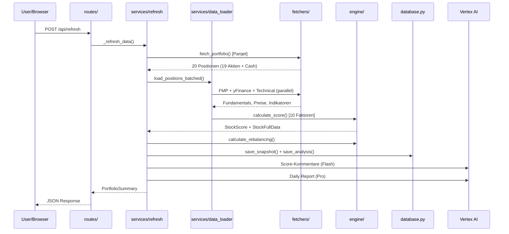
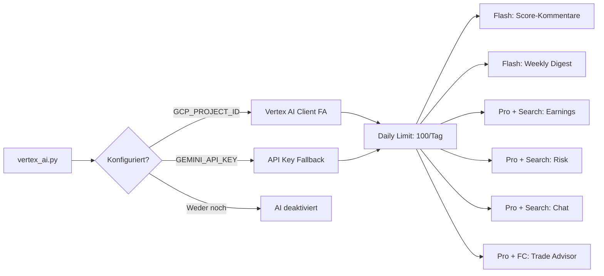

# PortfolioPilot – Architektur

## Übersicht

PortfolioPilot ist ein intelligentes Aktienportfolio-Dashboard mit automatisierter Multi-Faktor-Analyse.
Läuft lokal (Python) und auf Google Cloud Run (Docker).

```
PortfolioPilot/
├── main.py                 # FastAPI App + Lifespan + Scheduler
├── config.py               # Pydantic Settings v2 (.env auto-loading)
├── models.py               # 31 Pydantic-Datenmodelle
├── state.py                # Globaler State + Refresh-Progress
├── database.py             # SQLite Persistenz (WAL, Score-History, Snapshots)
├── cache_manager.py        # Thread-safe Memory+Disk Cache
├── logging_config.py       # structlog (JSON in Production, Console in Dev)
├── run_job.py              # Cloud Run Job Entry Point (tägliche Analyse + Report)
│
├── routes/
│   ├── portfolio.py        # GET /api/portfolio, /api/stock/{ticker}
│   ├── refresh.py          # POST /api/refresh + GET /api/refresh/status
│   ├── analysis.py         # POST /api/analysis/run, GET /api/analysis/latest
│   ├── analytics.py        # Dividenden, Risiko, Korrelation, Attribution
│   ├── demo.py             # POST /api/demo/activate|deactivate, GET /status
│   ├── shadow_portfolio.py # GET/POST /api/shadow-portfolio (Paper Trading Agent)
│   ├── parqet_oauth.py     # GET /api/parqet/authorize + /callback (OAuth2 PKCE)
│   ├── streaming.py        # GET /api/prices/stream (SSE)
│   └── telegram.py         # Telegram Webhook
│
├── services/
│   ├── refresh.py          # Voller Refresh (mit Progress-Tracking)
│   ├── data_loader.py      # Paralleles Batch-Loading (4er Batches)
│   ├── currency_converter.py # Zentrale EUR-Konvertierung
│   ├── portfolio_builder.py  # Parqet-Update + yFinance-Preise + calc_portfolio_totals()
│   ├── ai_agent.py         # Gemini AI + Telegram Reports
│   ├── telegram.py         # Telegram Bot API
│   ├── telegram_bot.py     # Command-Router + Handler
│   ├── vertex_ai.py        # Gemini Client + Daily Limit + Context Cache
│   ├── earnings_ai.py      # Earnings-Analyse (Gemini Pro + Search)
│   ├── score_commentary.py # AI Score-Kommentare (Flash)
│   ├── weekly_digest.py    # Wöchentlicher Digest (Flash)
│   ├── tech_radar_ai.py    # AI-gestützte Tech-Empfehlungen
│   ├── trade_advisor.py    # AI Trade Advisor (Function Calling + Structured Output + Chat)
│   ├── analyst_tracker.py  # Analysten Track Record Bewertung
│   ├── shadow_agent.py     # Autonome Buy/Sell/Hold Engine (Paper Trading)
│   ├── knowledge_data.py   # Wissens-Datenbank (Projekt-Fakten + tägliche Tipps)
│   └── url_fetcher.py      # URL Content Fetcher (HTML→Text für AI Tools)
│
├── engine/
│   ├── scorer.py           # 10-Faktor Scoring Engine v5
│   ├── rebalancer.py       # Portfolio-Rebalancing
│   ├── analysis.py         # Analyse-Reports → SQLite
│   ├── analytics.py        # Korrelation, Risiko, Dividenden
│   ├── attribution.py      # P&L Attribution (Sektor, Herfindahl-Index)
│   ├── portfolio_history.py # Portfolio-Historie (Einzelaktien, Cash, Cost-Basis)
│   ├── history.py          # Portfolio-Snapshots → SQLite
│   ├── backtest.py         # Score-Backtest Engine
│   └── sector_rotation.py  # Sektor-Rotation-Analyse (ETF-basiert)
│
├── fetchers/
│   ├── parqet.py           # Parqet Connect API (Performance + Activities)
│   ├── parqet_auth.py      # OAuth2 Token-Management (PKCE, Refresh)
│   ├── fmp.py              # Financial Modeling Prep API
│   ├── yfinance_data.py    # yFinance v1.2.0 (Recs, Insider, ESG, Altman Z, Piotroski, Earnings, Fundamentals)
│   ├── yfinance_ws.py      # yFinance WebSocket (Echtzeit International)
│   ├── technical.py        # RSI, SMA, MACD Berechnung
│   ├── fear_greed.py       # CNN Fear & Greed Index
│   ├── currency.py         # EUR/USD/DKK/GBP Wechselkurse
│   ├── yfinance_screener.py # Tech-Aktien Screening (yfinance)
│   └── demo_data.py        # Synthetische Demo-Daten
│
├── middleware/
│   └── auth.py             # Basic Auth Middleware (Passwortschutz)
│
├── static/                 # Frontend (HTML/JS/CSS + i18n DE/EN)
│   ├── index.html          # Modular HTML: Header, Tabs, Slide-Over, Bottom Nav
│   ├── app.js              # ~3400 LOC: Rendering, SSE, Theme, Toast, Heatmap, Shadow Agent
│   ├── translations.js     # i18n System (225 Keys, DE/EN) — t() Funktion + data-i18n
│   └── styles.css          # ~3800 LOC: Design System, Dark/Light Mode, Glassmorphism
└── tests/                  # 391 pytest Tests (22 Testdateien)
```

## Frontend-Architektur

### Design System (`styles.css`)
- **Theming**: Dark-Mode (default) + Light-Mode via `body.light-mode` class, auto-detect via `prefers-color-scheme`
- **Variables**: 20+ CSS Custom Properties (colors, shadows, radii, transitions)
- **Light-Mode Kontrast**: Text-Farben `#0a0a0a` / `#1a1a1a` / `#3a3a3a` für volle Lesbarkeit auf weißem Hintergrund

### UI-Komponenten

| Komponente | Funktion |
|------------|----------|
| **Action Dropdown** | `⋮ Aktionen` → Parqet Update, Score Refresh, Telegram, Demo Toggle |
| **Skeleton Loading** | Shimmer-Placeholders nur beim ersten Seitenaufruf |
| **Toast Notifications** | Slide-in Feedback-Cards (success/error/warning/info) |
| **Slide-Over Panel** | Rechts-Seitenleiste für Stock-Details mit 4 Tabs |
| **Treemap Heatmap** | CSS Grid (`auto-fill, minmax(90px, 1fr)`), sortiert nach Daily % |
| **AI Insight Widget** | Gradient-Border Card mit Portfolio-Zusammenfassung |
| **Mobile Bottom Nav** | Feste untere Navigation bei ≤768px Viewport |

### Live-Updates (ohne Flicker)

```
SSE (/api/prices/stream) → applyPriceUpdates() → Gezielte DOM-Updates
                                                    ├── updateHeaderValues()
                                                    └── updateTablePrices()

loadPortfolio() → renderDashboard() → requestAnimationFrame() → Batch-Paint
                   (Skeleton nur beim ersten Aufruf)
```

### Daily-Change Sanity-Cap
`quick_price_update()` in `yfinance_data.py` verwirft Tagesänderungen >±50% als Datenartefakte (Stock-Splits, Multi-Tages-Gaps, Währungskonvertierungsfehler). Log-Warning wird ausgegeben.

## Stabilität & Concurrency

Das Backend ist auf Ausfallsicherheit bei hängenden externen APIs ausgelegt:
- **Timeouts & Netzwerk:** Alle asynchronen `httpx` Aufrufe und Hintergrund-Lade-Prozesse (wie `yfinance` Thread-Pools) haben strikte, garantierte Timeouts (meist 5s bis 30s), um `ThreadPoolExecutor`-Erschöpfung und Deadlocks zu verhindern.
- **Background Tasks:** WebSocket-Streamer und Daten-Loads laufen isoliert via `asyncio.create_task()`. Startup-Prozesse lassen den Lifespan dank `asyncio.wait_for()` nicht hängen.
- **I/O Threads:** Synchrone Datenbank-Operationen (z.B. SQLite-Migrationen) werden via `asyncio.to_thread()` aus dem Main-Event-Loop herausgehalten.

## Datenfluss



## Persistenz-Schichten

| Schicht | Technologie | Inhalt | Verlust bei Restart? |
|---------|------------|--------|---------------------|
| **SQLite** (`portfoliopilot.db`) | WAL-Modus | Score-History, Snapshots, Reports | Ja (Cloud Run) |
| **JSON Cache** | Memory + Disk | FMP, yFinance, Parqet | Teilweise (volatile) |
| **State** (`portfolio_data`) | In-Memory Dict | Aktuelles Portfolio, Activities | Ja |

> **Cloud Run Hinweis:** SQLite-Daten gehen bei Container-Restart verloren. Für Langzeit-Persistenz: Litestream → GCS Backup.

## Demo Mode

Expliziter Demo-Toggle für externe Präsentationen — unabhängig von API-Keys.

| Endpoint | Funktion |
|----------|----------|
| `POST /api/demo/activate` | Baut Demo-Portfolio (12 fiktive Positionen) aus statischen Daten |
| `POST /api/demo/deactivate` | Löscht Demo-Daten, startet echten Refresh |
| `GET /api/demo/status` | Gibt Demo-Status zurück |

- **Kein API-Call** nötig — alle Daten aus `fetchers/demo_data.py`
- **Komplettes Portfolio**: Fundamentals, Analysten, Technical, Scores, Rebalancing, Tech Picks
- **Frontend**: 🎭 Demo-Button im Header, Banner, Badge
- **History Privacy**: Endpunkte wie `/api/portfolio/history-detail` und `/api/benchmark` nutzen im Demo-Modus ausschließlich synthetische Verlaufsdaten. Echte Portfolio-Werte (aus SQLite) werden hier strikt verborgen.

### Startup Port-Cleanup & Memory Limits
- **Port Cleanup**: `_kill_port_occupants()` in `main.py` beendet automatisch alte Server-Instanzen auf dem konfigurierten Port vor dem Start. Verhindert Whitescreen durch Zombie-Prozesse.
- **Speicherbedarf (RAM)**: Da `yfinance` intensiv `pandas` und `numpy` nutzt, muss der Cloud Run Container mit **mindestens 1024Mi (1 GB) RAM** betrieben werden (`--memory 1024Mi`). Startvorgänge unterhalb von 1GB führen durch Nebenläufigkeit bei der Kursdaten-Abfrage (`batch_size=2`) unweigerlich zu Out-Of-Memory (OOM) Abstürzen ("Truncated response body").

## AI-Architektur (Vertex AI)



## Caching-Strategie

### Cache-Typen

| Cache-Typ | Verhalten | Beispiele |
|-----------|-----------|-----------|
| **Volatile** | Beim Start gelöscht | Technical |
| **Persistent** | Bleibt erhalten | Parqet, Currency, FMP, yFinance, Fear&Greed |
| **State-Level** | Im Memory nach Refresh | Activities, Portfolio Summary |
| **Analytics** | In-Memory, 15min TTL, nach Refresh invalidiert | Korrelation, Risk, Benchmark |

### TTL pro Fetcher

| Cache | TTL | Begründung |
|-------|-----|------------|
| FMP | 24h | Fundamentaldaten ändern sich selten |
| yFinance | 24h | Recs, Insider, ESG, Altman Z, Piotroski, Earnings-Kalender, Fundamentals |
| Parqet | 12h | Portfolio-Positionen (Stale-Fallback bei Ablauf) |
| Currency | 12h | Wechselkurse (<0.5% Änderung/Tag) |
| Fear & Greed | 6h | Sentiment-Index (persistent über Restarts) |
| Technical | 4h | RSI, SMA, Momentum (volatile) |
| Analytics | 15min | Korrelation, Risk, Benchmark (invalidiert nach Refresh) |

### Startup-Cleanup

- Volatile Caches (Technical) werden beim Start gelöscht
- Verwaiste Dateien aus JSON→SQLite Migration werden aufgeräumt
- Activities-Cache auf Disk begrenzt auf 500 Einträge (~12 Monate)

## Sicherheit

| Schutzmaßnahme | Konfiguration | Schützt |
|----------------|---------------|---------|
| **Basic Auth** | `DASHBOARD_USER` + `DASHBOARD_PASSWORD` in `.env` | Dashboard + alle API-Endpoints |
| **Webhook Secret** | `TELEGRAM_WEBHOOK_SECRET` in `.env` | Telegram-Webhook (Secret im URL-Pfad) |
| **Chat-ID Filter** | `TELEGRAM_CHAT_ID` in `.env` | Bot antwortet nur auf deine Chat-ID |
| **timing-safe compare** | `secrets.compare_digest()` | Verhindert Timing-Attacks auf Passwort |

- Auth-Middleware in `middleware/auth.py` (Starlette BaseHTTPMiddleware)
- Ausgenommen: `/health` (Cloud Run Health Check), `/api/telegram/webhook/{secret}`
- Ohne `DASHBOARD_USER`/`DASHBOARD_PASSWORD` → kein Passwortschutz (z.B. lokal)

## Cloud Run Deployment

### Service (Dashboard + Webhook)
```
Docker Image (python:3.12-slim, 1 Worker)
  ├── App-Code + SQLite DB
  ├── cache/ (Stale Cache Fallback)
  └── Env-Vars (API Keys, OAuth2 Tokens, Auth)

Konfiguration:
  Memory:        1 Gi (min. für pandas/yfinance)
  CPU:           1 + CPU Boost
  Min Instances: 0 (Scale to Zero)
  Max Instances: 1
  Region:        europe-west1
  CPU Throttling: Aus (--no-cpu-throttling)
```

### Keep-Alive (Cloud Scheduler)
```
Job:      portfoliopilot-keepalive
Schedule: */10 8-22 * * 1-5 (alle 10min, Mo-Fr 08-22 CET)
Target:   GET /health
Zweck:    Hält den Container wach damit APScheduler
          (Reports, Intraday-Updates) zuverlässig läuft.
Kosten:   0 €/Monat (Free Tier: 3 Jobs kostenlos)
```

### Job (tägliche Analyse + Telegram Report)
```
Docker Image (Dockerfile.job, python:3.12-slim)
  └── CMD: python run_job.py

Ablauf:
  1. Full Refresh (Parqet, FMP, yfinance, Technicals, Scoring)
  2. Daten-Validierung (Positionen + Scores vorhanden?)
  3. Gemini AI Research → Telegram Report

Trigger: Cloud Scheduler → 15:45 CET täglich
Kosten:  0 €/Monat (Free Tier)
```

### Scheduler (APScheduler)

| Job | Zeit | Funktion |
|-----|------|----------|
| Full Analyse | 16:15 CET | Refresh + Scoring + AI Report |
| Shadow Agent | Mo-Fr 17:00 CET | Autonomer Paper-Trading-Zyklus (Gemini Pro) |
| News-Kurator | Mo-Fr 09, 13, 17, 21 | Proaktive Portfolio-News-Alerts |
| Intraday Kurse | alle 15min Mo-Fr 8-22h | yFinance Batch |
| Weekly Digest | Freitag 22:30 | KI-Zusammenfassung |
| Cloud Run Job | 15:45 CET (Cloud Scheduler) | Full Refresh → Telegram Report |

> **Wichtig:** Der APScheduler läuft in-process im Cloud Run Container. Ohne den `portfoliopilot-keepalive` Cloud Scheduler Job würde der Container bei Inaktivität abschalten und alle geplanten Jobs stoppen.

## Shadow Portfolio Agent

Autonomer AI-Agent der ein fiktives Paper-Trading-Portfolio verwaltet:

```
Perception → Echtes Portfolio + Marktdaten + Shadow-State lesen
     ↓
Reasoning  → Gemini 2.5 Pro (Function Calling) evaluiert Kandidaten
     ↓
Action     → Fiktive Trades in Shadow-DB ausführen (Buy/Sell/Hold)
     ↓
Reporting  → Performance-Tracking, Decision-Log, Telegram-Report
```

### Shadow SQLite-Schema (6 Tabellen)

| Tabelle | Beschreibung |
|---------|-------------|
| `shadow_portfolio` | Aktuelle Positionen (Ticker, Shares, Avg Cost, Sektor) |
| `shadow_transactions` | Kauf-/Verkaufshistorie mit AI-Begründung |
| `shadow_performance` | Tägliche Performance-Snapshots (Shadow vs. Real) |
| `shadow_decision_log` | AI-Entscheidungsprotokolle pro Zyklus |
| `shadow_meta` | Key-Value Store (Init-Status, Cash, Startkapital) |
| Config (in shadow_meta) | JSON-gespeicherte Agenten-Regeln (Strategy, Limits) |

### Agenten-Regeln (konfigurierbar)
- Max 20 Positionen, Max 10% Gewichtung/Position
- Min 5% Cash-Reserve, Min 500 EUR Trade-Volumen
- Max 3 Trades/Zyklus, Max 35% Sektor-Konzentration
- 3 Strategie-Modi: Conservative, Balanced, Aggressive

### Shadow API (`routes/shadow_portfolio.py`)
8 Endpoints für Dashboard-Integration: Portfolio-Stand, Agent-Run, Transactions, Performance, Decision-Log, Reset, Config (GET/POST).
