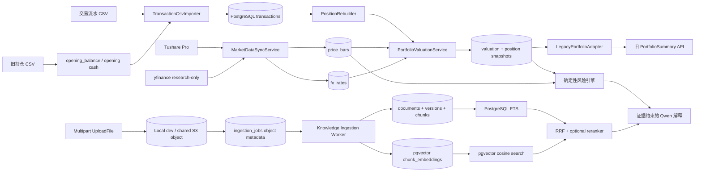

# PortfolioPilot 当前架构

## 产品定位

PortfolioPilot 是“面向 A 股与美股的多市场投资组合风险分析与证据驱动投研平台”。系统只用于研究与软件演示，不连接券商、不执行真实交易，也不构成投资建议。

## 核心原则

1. PostgreSQL `transactions` 是组合持仓与现金的唯一事实源。
2. `position_snapshots` 和 `portfolio_valuation_snapshots` 是可删除、可重建的派生结果。
3. 原始行情保留证券原币；FX 作为独立历史事实存储，估值时转换到组合基准币种。
4. 风险指标和调仓权重由确定性模块计算；LLM 只解释结构化数字和本次检索证据。
5. 每次同步、估值、风险和 LLM 运行保留数据截止时间、代码/模型版本、输入哈希和证据 lineage。
6. mock、research-only 和 fallback 必须显式标记，不得伪装成真实行情或真实模型输出。

## 技术栈

- Python 3.12、FastAPI、Pydantic v2
- PostgreSQL 16、SQLAlchemy 2.x Async ORM、asyncpg、Alembic
- pandas、NumPy
- Tushare Pro 与 yfinance Provider Adapter
- Qwen/OpenAI-Compatible LLM API
- pgvector、PostgreSQL 全文检索与 RRF 混合检索
- SQLite 显式兼容与迁移层；核心治理链路不依赖它，少量默认关闭的旧扩展仍可能写入
- pytest、pytest-asyncio、pytest-cov、Ruff、Mypy、Docker Compose

## 目录与职责

```text
app/api/                    DB-backed portfolio、market-data、health 与 governed evaluation API
app/db/models/              SQLAlchemy Declarative Mapping
app/db/repositories/        SQL 查询与原子 upsert 边界
app/domain/                 不依赖 HTTP 的账本结果模型
app/providers/market_data/  Tushare/yfinance 统一 Provider 合同
app/providers/embeddings.py 应用级复用的语义/测试 Embedding Provider
app/services/               账本、导入、持仓重建、估值、兼容适配
app/storage/                Local/S3-compatible 对象存储协议
app/workers/                独立 Session、互斥锁和可追踪任务入口
analytics/                  确定性风险指标
backtest/                   point-in-time 回测、权重漂移与可用性矩阵
evaluation/                 V1 兼容评测与可人工复核的 V2 分模式评测集
rag/                        文档解析、Chunking、查询意图与离线兼容工具
workflows/                  PostgreSQL-backed 受控研究工作流
migrations/                 PostgreSQL schema 唯一变更入口
scripts/                    初始化与兼容迁移工具
tests/contracts/            全量 route 与核心 OpenAPI contract 快照
```

## 数据主链路


```mermaid
flowchart LR
    CSV[交易流水 CSV] --> IMPORT[TransactionCsvImporter]
    LEGACY[旧持仓 CSV] --> OPENING[opening_balance / opening cash]
    OPENING --> IMPORT
    IMPORT --> TX[(PostgreSQL transactions)]

    TS[Tushare Pro] --> SYNC[MarketDataSyncService]
    YF[yfinance research-only] --> SYNC
    SYNC --> PB[(price_bars)]
    SYNC --> FX[(fx_rates)]

    TX --> REBUILD[PositionRebuilder]
    REBUILD --> VAL[PortfolioValuationService]
    PB --> VAL
    FX --> VAL
    VAL --> VS[(valuation + position snapshots)]

    VS --> LEGACY_ADAPTER[LegacyPortfolioAdapter]
    LEGACY_ADAPTER --> UI[旧 PortfolioSummary API]
    VS --> RISK[确定性风险引擎]
    PB --> RISK
    RISK --> LLM[证据约束的 Qwen 解释]

    UPLOAD[Multipart UploadFile] --> OS[(Local dev / shared S3 object)]
    OS --> IJ[(ingestion_jobs object metadata)]
    IJ --> IW[Knowledge Ingestion Worker]
    IW --> RD[(documents + versions + chunks)]
    IW --> CE[(pgvector chunk_embeddings)]
    RD --> FTS[PostgreSQL FTS]
    CE --> DENSE[pgvector cosine search]
    FTS --> RRF[RRF + optional reranker]
    DENSE --> RRF
    RRF --> LLM
```

旧持仓 CSV 不会被描述成完整交易历史。证券行转换为 `opening_balance`，现金行转换为 opening cash `deposit`，导入响应返回 `history_completeness=opening_balance_only`。

## 交易账本

`TransactionLedgerService` 使用以下语义：

- `quantity`、`gross_amount`、`fees`、`taxes` 均为非负绝对值；
- `transaction_type` 决定现金和数量方向；
- `buy` 减少现金，`sell`、`dividend` 增加现金；
- `deposit/withdrawal` 与 `transfer_in/transfer_out` 改变分币种现金账本；
- `split` 只改变数量和单位成本；
- 第一版成本法固定为 `weighted_average`；
- 任意卖出导致负持仓时，整笔写入或整批导入回滚。

交易按 `occurred_at, created_at, id` 稳定排序。重建输出证券持仓、分币种现金、warning、最后交易时间和历史完整性。

## 证券主数据与 Provider

币种、交易所、市场和国家来自 `securities`，不通过 ticker 后缀猜测币种。`provider_symbols` 保存显式映射，例如：

| Canonical | Tushare | yfinance | FMP |
|---|---|---|---|
| `600519.SH` | `600519.SH` | `600519.SS` | - |
| `AAPL` | - | `AAPL` | `AAPL` |

`MarketDataProvider` 统一提供 security master、日频 OHLCV、FX 和 corporate action 查询。Tushare 是 A 股事实源；yfinance 面向美股与 ETF 研究演示，所有落库记录使用 `source=yfinance_research` 且 `raw_payload.research_only=true`。FMP 不参与价格事实源优先级。

## 估值与可追溯性

估值公式：

```text
native_market_value = quantity * native_price
market_value_base = native_market_value * valuation_fx_rate
```

`PortfolioValuationService` 只读取 `as_of` 之前、且在知识截止时间前可得的有效行情和 FX。每个 position snapshot 保存 `price_bar_id`、`fx_rate_id`、原币价格、估值 FX、基准币种市值、成本和未实现盈亏。

输入交易、行情、FX 和组合配置被规范化后计算 `input_hash`。相同 `portfolio_id + as_of + source` 重复运行会更新同一快照，并产生相同 input hash。

## Session 与 Worker

每个 FastAPI 请求使用独立 `AsyncSession`。每次 Worker 调用也创建自己的 Session，不跨并发任务共享。Worker 使用 PostgreSQL advisory transaction lock 防止同类同步并发执行，并在 `sync_runs` 中记录 started/completed/failed、计数、重试、错误摘要、代码版本与 data cutoff。

日流水线区分两个时间边界：任务开始时只冻结一次 `valuation_as_of`，用于交易账本和估值日期；行情同步成功后再冻结一次统一 `knowledge_cutoff`，用于所有资产的行情/FX `data_as_of` 可见性判断。估值不会逐资产调用当前时间。本次同步晚于任务开始但不晚于该 cutoff 的数据可被使用，cutoff 之后的数据不可见。部分 Provider 失败的成功源、失败源和降级状态写入 run 与 snapshot lineage；全部失败时 run 的 `data_as_of` 保持 `null`，并停止后续估值。

```bash
python -m app.workers.run_market_sync
python -m app.workers.run_position_rebuild
python -m app.workers.run_daily_pipeline
python -m app.workers.run_knowledge_ingestion --once
python -m app.workers.run_research_workflow --once
python -m app.workers.run_embedding_backfill
python -m app.workers.run_storage_cleanup
```

Web 进程不再运行 APScheduler，也不会在启动时自动请求行情或修改组合状态；定时调度应由 cron、CI scheduler、Cloud Scheduler 或独立任务平台调用 Worker。

`run_daily_pipeline` 的调度模型是一次性批处理。Render 将其声明为 `type: cron`，而不是 Background Worker；进程依次完成行情同步与估值后正常退出。父级 `sync_run` 使用日期作用域 `run_key`，整条流水线持有 PostgreSQL session advisory lock，子任务继续保留自己的 transaction advisory lock。已完成的同日任务直接返回幂等 replay，失败记录可由下一次触发接管重试。

## 对象存储与部署边界

应用 lifespan 复用一个 `ObjectStorage` 实例，Web、Cron 和独立 Worker 均通过同一协议按 object key 访问内容。development/test 可以使用 `LocalObjectStorage`；production 可写模式只允许 `S3CompatibleObjectStorage`。数据库中的 `ingestion_jobs` 保存 object key、checksum、content type、provider version、owner 和 permission groups，不保存容器本地路径或伪造 URI。

源文件上传先由服务端 Principal 校验角色和 permission groups，下载再次校验 owner、管理员角色或授权组。Worker 作为内部可信执行者按 key 读取。S3 bucket 可访问性属于 readiness 依赖；只读 production 不需要写型对象存储，状态明确为 `not_required`，不会静默创建一个 local fallback。

Render Web、Cron 和 Background Worker 的文件系统彼此独立，Cron 不能挂载或读取 Web 的 Persistent Disk。因此 production 中需要跨进程访问的源对象必须进入共享 bucket。详细环境变量、服务类型和恢复顺序见 [deployment.md](deployment.md)。

`python -m app.core.preflight` 与 `/health/ready` 共用同一检查逻辑：PostgreSQL、Alembic head、pgvector、Embedding、对象存储、production auth 和读写模式约束任一失败都会返回非就绪；`/health/live` 只表示进程存活。

## API 与兼容层

`main.py` 直接从 `app.api` 注册 health、portfolio、market-data 和 evaluation router。
`routes/evaluation.py` 只保留到 v3 compatibility boundary 的 import shim，不复制 endpoint 逻辑，
也不会在正常请求中输出 deprecation 日志。其余根 `routes` 仍按
[legacy-migration-map.md](legacy-migration-map.md) 渐进迁移。

删除或移动 route 前必须先运行：

```bash
python -m scripts.export_api_contract --check
python -m pytest -q tests/unit/test_api_contracts.py
```

`fastapi_routes_v1.json` 保存全部 OpenAPI operation；`core_api_contract_v1.json` 保存核心请求、
响应和递归引用 schema。快照变化必须由明确 API 变更说明支持，不能为通过测试而直接重生成。
只有评审确认 contract 有意变化后，才运行不带 `--check` 的导出命令更新基线。

新的 DB API：

```text
GET  /api/portfolios
GET  /api/portfolios/{id}
GET  /api/portfolios/{id}/transactions
POST /api/portfolios/{id}/imports/transactions
GET  /api/portfolios/{id}/positions?as_of=
GET  /api/portfolios/{id}/valuation?as_of=
POST /api/portfolios/{id}/rebuild?as_of=
POST /api/market-data/sync
```

旧 `/api/portfolio`、行业和资产分布接口仍返回原 `PortfolioSummary` 结构，但数据由 `LegacyPortfolioAdapter` 从 PostgreSQL valuation snapshot 生成，不再以 `state.portfolio_data` 作为真实组合来源。显式 demo 数据仍保留 `is_demo=true`。

## 研究治理与混合检索

知识文档、版本、Chunk、Embedding、Prompt、LLM Trace、Workflow、人工审核和发布报告均持久化于 PostgreSQL。文档入库由独立 Worker 完成，Chunk 在写入时生成并保存 Embedding；查询时仅编码 query，不会重新编码全部文档。

检索先在数据库内执行 ACL、发布版本、有效期与元数据过滤，再分别运行 PostgreSQL `tsvector` 全文检索和 pgvector cosine 检索，最后用 RRF 合并，可配置 Reranker。所有权限来自服务端 `Principal`；客户端 Body/Header 不能声明 `user_id`、permission groups 或 reviewer identity。

Qwen/OpenAI-Compatible HTTP client 与 Embedder 在应用 lifespan 内复用。默认 Embedder 是 384 维多语言 SentenceTransformer；production 禁止 hashing fallback，资源不可用会使 readiness 失败。每次 LLM Trace 保存 Prompt 版本、模型、证据 ID、数据截止时间、代码版本、Provider 原始 usage、usage 来源和成本来源。Provider 未返回 usage 或账单金额时分别标记为估算，不冒充真实成本。

Workflow 的 POST 入口只创建 `PENDING` run 并返回 202。独立 Worker 以 `FOR UPDATE SKIP LOCKED` 领取任务，使用 `lease_owner/heartbeat_at/lease_expires_at` 处理进程崩溃；每个节点单独提交 checkpoint。节点唯一键、稳定 LLM Trace key、ReviewTask iteration 唯一键和 PublishedReport run 唯一键共同保证恢复幂等。

SQLite 只保留显式迁移与校验用途，核心服务不依赖 `database._get_conn`。完整边界见 [current-limitations.md](current-limitations.md)。

## 回测与 LLM 分工

回测使用 `t-1` 收盘后估计、`t` 收盘成交、`t+1` 收益生效的固定口径。策略逐日按资产收益漂移权重，调仓换手率比较成交前漂移权重与执行权重。价格状态区分 observed、休市、停牌、数据缺失和尚未上市；只有休市和停牌允许持价，收益率不前向填充。

`backtest_runs` 保存数据、代码、配置和组合快照 provenance；`backtest_rebalance_snapshots` 保存每次调仓前后权重、eligible universe、排除原因和成本；`backtest_strategy_results` 保存策略指标与 NAV。相同组合快照、价格数据、配置和代码版本生成相同缓存键。

确定性优化器独占 `target_weight`。LLM 合同只输出 `research_observations` 与
`review_priorities`，旧 `rebalance_suggestions` 仅为 deprecated 兼容字段。

V2 评测集使用 60 个唯一 case 覆盖检索、生成和工作流，并将公开来源元数据、模拟字段、数据截止
时间、split 和 SHA256 写入 manifest。`synthetic_smoke`、`live_model_eval`、`human_gold_eval` 与
`production_monitoring` 分目录保存，不能互相覆盖。CI 不调用真实模型；live 禁止 mock，human gold
只读取 independently approved labels，production 只读取显式生产观测。Dashboard 展示样本数、
cutoff、人工复核数、Wilson 区间和 badcase，不把不同层指标合并成单一准确率。V1 runner 与报告
结构继续兼容，详细边界见 [evaluation-v2.md](evaluation-v2.md)。
