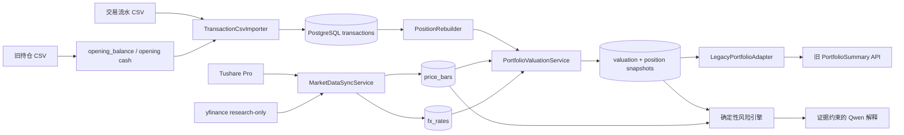

# PortfolioPilot 当前架构

## 产品定位

PortfolioPilot 是“面向 A 股与美股的多市场投资组合风险分析与证据驱动投研平台”。系统只用于研究与软件演示，不连接券商、不执行真实交易，也不构成投资建议。

## 核心原则

1. PostgreSQL `transactions` 是组合持仓与现金的唯一事实源。
2. `position_snapshots` 和 `portfolio_valuation_snapshots` 是可删除、可重建的派生结果。
3. 原始行情保留证券原币；FX 作为独立历史事实存储，估值时转换到组合基准币种。
4. 风险指标和调仓权重由确定性模块计算；LLM 只解释结构化数字和本次检索证据。
5. 每次同步、估值、风险和 LLM 运行保留数据截止时间、代码/模型版本、输入哈希和证据 lineage。
6. mock、research-only 和 fallback 必须显式标记，不得伪装成真实行情或真实模型输出。

## 技术栈

- Python 3.12、FastAPI、Pydantic v2
- PostgreSQL 16、SQLAlchemy 2.x Async ORM、asyncpg、Alembic
- pandas、NumPy
- Tushare Pro 与 yfinance Provider Adapter
- Qwen/OpenAI-Compatible LLM API
- SQLite 兼容层，用于尚未迁移的知识、Prompt、Trace 和 Workflow 数据
- pytest、pytest-asyncio、pytest-cov、Ruff、Mypy、Docker Compose

## 目录与职责

```text
app/api/                    DB-backed portfolio、import、market-data、health API
app/db/models/              SQLAlchemy Declarative Mapping
app/db/repositories/        SQL 查询与原子 upsert 边界
app/domain/                 不依赖 HTTP 的账本结果模型
app/providers/market_data/  Tushare/yfinance 统一 Provider 合同
app/services/               账本、导入、持仓重建、估值、兼容适配
app/workers/                独立 Session、互斥锁和可追踪任务入口
analytics/                  确定性风险指标
rag/                        当前 SQLite-backed 知识治理与混合检索
workflows/                  当前 SQLite-backed 受控研究工作流
migrations/                 PostgreSQL schema 唯一变更入口
scripts/                    初始化与兼容迁移工具
```

## 数据主链路


```mermaid
flowchart LR
    CSV[交易流水 CSV] --> IMPORT[TransactionCsvImporter]
    LEGACY[旧持仓 CSV] --> OPENING[opening_balance / opening cash]
    OPENING --> IMPORT
    IMPORT --> TX[(PostgreSQL transactions)]

    TS[Tushare Pro] --> SYNC[MarketDataSyncService]
    YF[yfinance research-only] --> SYNC
    SYNC --> PB[(price_bars)]
    SYNC --> FX[(fx_rates)]

    TX --> REBUILD[PositionRebuilder]
    REBUILD --> VAL[PortfolioValuationService]
    PB --> VAL
    FX --> VAL
    VAL --> VS[(valuation + position snapshots)]

    VS --> LEGACY_ADAPTER[LegacyPortfolioAdapter]
    LEGACY_ADAPTER --> UI[旧 PortfolioSummary API]
    VS --> RISK[确定性风险引擎]
    PB --> RISK
    RISK --> LLM[证据约束的 Qwen 解释]
```

旧持仓 CSV 不会被描述成完整交易历史。证券行转换为 `opening_balance`，现金行转换为 opening cash `deposit`，导入响应返回 `history_completeness=opening_balance_only`。

## 交易账本

`TransactionLedgerService` 使用以下语义：

- `quantity`、`gross_amount`、`fees`、`taxes` 均为非负绝对值；
- `transaction_type` 决定现金和数量方向；
- `buy` 减少现金，`sell`、`dividend` 增加现金；
- `deposit/withdrawal` 与 `transfer_in/transfer_out` 改变分币种现金账本；
- `split` 只改变数量和单位成本；
- 第一版成本法固定为 `weighted_average`；
- 任意卖出导致负持仓时，整笔写入或整批导入回滚。

交易按 `occurred_at, created_at, id` 稳定排序。重建输出证券持仓、分币种现金、warning、最后交易时间和历史完整性。

## 证券主数据与 Provider

币种、交易所、市场和国家来自 `securities`，不通过 ticker 后缀猜测币种。`provider_symbols` 保存显式映射，例如：

| Canonical | Tushare | yfinance | FMP |
|---|---|---|---|
| `600519.SH` | `600519.SH` | `600519.SS` | - |
| `AAPL` | - | `AAPL` | `AAPL` |

`MarketDataProvider` 统一提供 security master、日频 OHLCV、FX 和 corporate action 查询。Tushare 是 A 股事实源；yfinance 面向美股与 ETF 研究演示，所有落库记录使用 `source=yfinance_research` 且 `raw_payload.research_only=true`。FMP 不参与价格事实源优先级。

## 估值与可追溯性

估值公式：

```text
native_market_value = quantity * native_price
market_value_base = native_market_value * valuation_fx_rate
```

`PortfolioValuationService` 只读取 `as_of` 之前、且在知识截止时间前可得的有效行情和 FX。每个 position snapshot 保存 `price_bar_id`、`fx_rate_id`、原币价格、估值 FX、基准币种市值、成本和未实现盈亏。

输入交易、行情、FX 和组合配置被规范化后计算 `input_hash`。相同 `portfolio_id + as_of + source` 重复运行会更新同一快照，并产生相同 input hash。

## Session 与 Worker

每个 FastAPI 请求使用独立 `AsyncSession`。每次 Worker 调用也创建自己的 Session，不跨并发任务共享。Worker 使用 PostgreSQL advisory transaction lock 防止同类同步并发执行，并在 `sync_runs` 中记录 started/completed/failed、计数、重试、错误摘要、代码版本与 data cutoff。

```bash
python -m app.workers.run_market_sync
python -m app.workers.run_position_rebuild
python -m app.workers.run_daily_pipeline
```

Web 进程不再运行 APScheduler，也不会在启动时自动请求行情或修改组合状态；定时调度应由 cron、CI scheduler、Cloud Scheduler 或独立任务平台调用 Worker。

## API 与兼容层

新的 DB API：

```text
GET  /api/portfolios
GET  /api/portfolios/{id}
GET  /api/portfolios/{id}/transactions
POST /api/portfolios/{id}/imports/transactions
GET  /api/portfolios/{id}/positions?as_of=
GET  /api/portfolios/{id}/valuation?as_of=
POST /api/portfolios/{id}/rebuild?as_of=
POST /api/market-data/sync
```

旧 `/api/portfolio`、行业和资产分布接口仍返回原 `PortfolioSummary` 结构，但数据由 `LegacyPortfolioAdapter` 从 PostgreSQL valuation snapshot 生成，不再以 `state.portfolio_data` 作为真实组合来源。显式 demo 数据仍保留 `is_demo=true`。

## 尚未迁移的数据

知识库、Prompt Registry、LLM Trace、Workflow 审批和部分可选扩展仍使用 SQLite。它们不参与持仓、现金、行情或估值事实计算。完整边界见 [current-limitations.md](current-limitations.md)。
