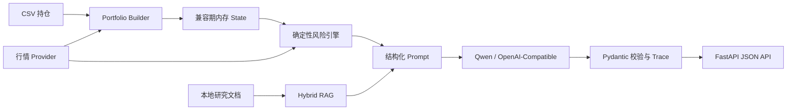

# PortfolioPilot 当前架构

## 产品定位

PortfolioPilot 是“面向 A 股与美股的多市场投资组合风险分析与证据驱动投研平台”。当前版本用于金融科技、AI 应用和后端工程研究演示，不连接券商，不执行真实交易，也不构成投资建议。

本文件描述 PR-1 完成后的增量架构。PostgreSQL 异步持久化基础已经建立，旧业务仍保留 SQLite 读取和根目录模块；真实持仓切换到 transaction ledger 属于后续阶段。

## 技术栈

- Python 3.12、FastAPI、Pydantic v2
- pandas、NumPy、yfinance/FMP 数据适配
- Qwen 或通用 OpenAI-Compatible LLM API
- PostgreSQL 16、pgvector、SQLAlchemy 2.x Async ORM、asyncpg、Alembic
- SQLite 兼容读取、JSON 磁盘缓存和进程内状态
- 原生 HTML、CSS、JavaScript
- pytest、pytest-cov、Ruff、Mypy、Docker

## 模块边界

```text
main.py                    FastAPI 创建、生命周期、调度器和路由注册
config.py                  环境变量、功能开关和 Provider 配置
time_utils.py              UTC 持久化时间与展示时区转换
models.py                  现有 Pydantic API/业务模型
database.py                旧 SQLite 兼容持久化层
state.py                   兼容期内的进程内组合状态

app/db/models/             SQLAlchemy 2.x Declarative Mapping
app/db/repositories/       PostgreSQL 数据访问边界
app/db/session.py          asyncpg engine 与独立 AsyncSession 工厂
app/api/health.py          liveness/readiness 路由
app/workers/               Worker 独立 Session 边界
migrations/                Alembic async migration 环境
scripts/                   显式 SQLite 到 PostgreSQL 迁移入口

routes/                    HTTP API 兼容层
services/                  组合构建、分析、Provider 编排
services/llm_client.py     Qwen/OpenAI-Compatible 中立客户端
services/llm/compat.py     旧 generate-content 调用适配层
services/market_data/      历史行情 Provider 接口与质量元数据
analytics/                 确定性风险计算
portfolio_optimizer/       确定性权重研究算法
rag/                       文档治理、切片和混合检索
prompts/                   Prompt Registry 与输出契约
workflows/                 受控研究报告工作流
backtest/                  策略比较与研究演示报告
evaluation/                Retrieval/Generation/Workflow 评测
static/                    现有原生 Web 前端
```

## 核心请求链路


```mermaid
flowchart LR
    CSV[CSV 持仓] --> PB[Portfolio Builder]
    MD[行情 Provider] --> PB
    PB --> STATE[兼容期内存 State]
    STATE --> RISK[确定性风险引擎]
    MD --> RISK
    DOCS[本地研究文档] --> RAG[Hybrid RAG]
    RISK --> PROMPT[结构化 Prompt]
    RAG --> PROMPT
    PROMPT --> LLM[Qwen / OpenAI-Compatible]
    LLM --> VALIDATE[Pydantic 校验与 Trace]
    VALIDATE --> API[FastAPI JSON API]
```

风险数值和优化权重由确定性模块计算。LLM 只消费结构化风险结果和本次检索到的 evidence，并负责生成有证据约束的解释；输出不合法时会重试，最终回退到明确标记的安全模板。

## LLM 架构

新代码使用 `services/llm_client.py`：

- `QwenClient`：调用 DashScope OpenAI-Compatible Chat Completions。
- `OpenAICompatibleClient`：调用显式配置的兼容端点。
- `ChatRequest`、`ChatMessage`、`ToolDefinition`、`ChatResponse`：供应商中立契约。
- `get_llm_client()`：只返回真实配置的 Provider；缺少 Key 时明确报错，不伪装为真实模型。

`services/vertex_ai.py` 仅保留弃用兼容导入。旧业务暂时经 `services/llm/compat.py` 适配，其内部仍可使用原有 `client.aio.models.generate_content(...)` 调用形状；新代码不得继续依赖该形状。

结构化金融分析使用另一层轻量 `LLMProvider` 协议。无真实 Key 时返回的 mock/fallback 会携带 `source` 和 `ai_available=false`，不得作为真实模型输出展示。

## 数据与持久化

当前存在四类状态：

| 类型 | 当前实现 | 说明 |
|---|---|---|
| 新数据库基础 | PostgreSQL + pgvector | transaction ledger、行情、汇率、派生快照和运行追踪的首批表 |
| 兼容业务持久化 | SQLite `cache/portfoliopilot.db` | 当前快照、评分、知识、Prompt、Trace、Workflow 和可选模拟组合 |
| 外部数据缓存 | `cache/*.json` | 行情和外部 Provider 缓存，带 UTC `_cached_at` |
| 在线状态 | `state.portfolio_data` | 当前组合与刷新状态，进程重启后重建 |

PostgreSQL 使用 `TIMESTAMPTZ`，asyncpg 连接会话固定为 UTC；金额、价格、数量和汇率使用 `NUMERIC`，动态配置和运行快照使用 `JSONB`。`DISPLAY_TIMEZONE` 仅控制展示，默认 `Asia/Shanghai`。

每个 FastAPI 请求通过应用级 dependency 创建独立 `AsyncSession`。Worker 每次任务调用独立进入 `worker_session()`；并发任务只共享 engine pool 和 sessionmaker，绝不共享 Session。Route 不直接执行 SQL，新 PostgreSQL 访问统一经过 Repository。

表结构只由 Alembic 管理。应用 import 不连接数据库、不执行建表；旧 SQLite schema 在 FastAPI lifespan 中显式初始化。

当前真实组合仍主要通过 CSV 或可选 Parqet position 数据构建，尚未迁移为以 transactions 为唯一事实源；该迁移不属于 PR-1。

## 行情与风险

`services/market_data/` 为历史复权行情提供统一接口，返回：

- `source` 和 `as_of`
- 实际起止日期
- 缺失和陈旧 ticker
- 资产覆盖率

风险引擎计算收益、年化波动率、最大回撤、Sharpe、资产权重、行业集中度和资产类型敞口。样本不足时返回 unavailable/null 语义，不把未知风险写成零风险。

yfinance 仅用于公开数据研究演示，不承诺实时性、完整性、公司行动口径或生产 SLA。

## RAG 与 Trace

RAG 支持 `txt`、`md`、`csv`、`pdf`，并包含文档版本、checksum、发布状态、有效期和权限组。检索顺序为 metadata/权限/时间过滤、BM25+dense、RRF、可选 reranker 和去重。

sentence-transformers 或 FAISS 不可用时，系统使用确定性 hashing embedding 和 NumPy 检索，并在能力边界内继续运行。没有可用文档时返回 `evidence_insufficient=true`。

LLM Trace 保存 Prompt 版本、Provider、模型、输入哈希、证据 ID、校验状态、延迟和 fallback 状态。当前 Trace 仍存储在 SQLite。

## 回测边界

`backtest/strategy_backtester.py` 已实现按再平衡日滚动估计、训练区间检查、交易成本、滑点和 OOS 区间报告。它仍不是生产级严格 point-in-time walk-forward 系统：缺少交易所日历、逐时点可得性数据库、完整公司行动/退市处理、不可变数据版本以及历史 LLM snapshot 的持续采集。

没有本地价格 CSV 时，CLI 可以生成固定种子的 mock 行情，报告必须标记 `mock_price_data_used=true`。机构研究结论不得使用 mock 报告。

## 可选扩展

以下能力保留但默认关闭：

| 扩展 | 开关 | 默认值 |
|---|---|---|
| Polymarket 示例资产处理 | `ENABLE_POLYMARKET` | `false` |
| Telegram 报告与 Webhook | `ENABLE_TELEGRAM` | `false` |
| Parqet OAuth/持仓同步 | `ENABLE_PARQET` | `false` |
| Shadow Agent 模拟组合 | `ENABLE_SHADOW_AGENT` | `false` |

关闭扩展不会影响 CSV 导入、A 股/美股风险分析、RAG、结构化 LLM 分析和回测命令。Shadow Agent 只处理模拟资金，开启后仍不连接券商。

## CI 与部署

`.github/workflows/ci.yml` 在 `main` 的 push 和 pull request 上执行：

1. `ruff check .`
2. `mypy`
3. pytest 与 coverage report
4. Docker image build

`.github/workflows/deploy.yml` 不再包含个人 GCP 项目、旧项目名或旧集成 Secret。Cloud Run 项目、区域、Workload Identity Provider 和 Service Account 由 GitHub Variables 提供；默认部署只启用核心平台。

## 已知限制

完整限制和 mock/fallback 触发条件见 [current-limitations.md](current-limitations.md)。
