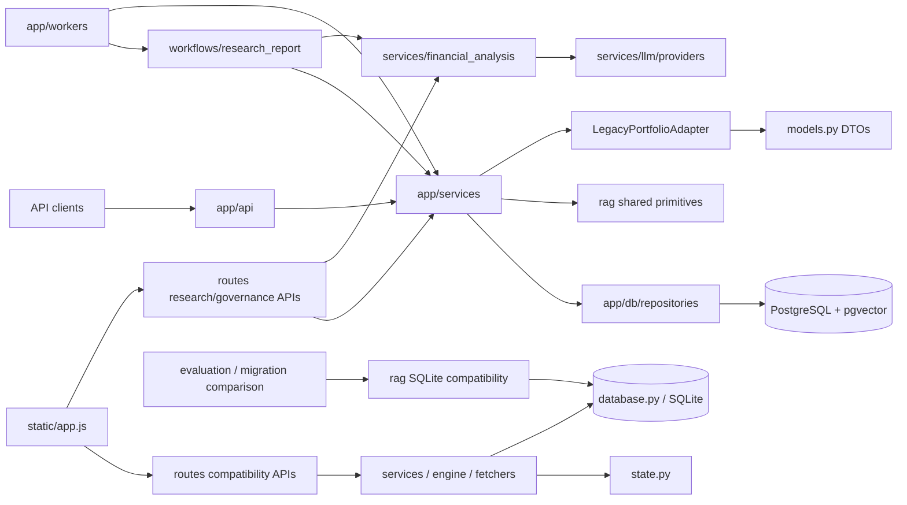

# Legacy / Compatibility 迁移地图

> 审计基线：`agent/postgres-rag-governance`，commit
> `0c44d34bb010417c086503f3acacf662d829e208`，2026-08-20。
>
> 本文是依赖审计与迁移计划，不代表已完成目录迁移，也不授权删除兼容接口。

阶段 B 更新（2026-08-20）：删除已复核的 `engine/history.py` 与 `workflows/models.py`；
`routes/evaluation.py` 已迁移为 `app/api/evaluation.py` 的纯导入兼容层。删除前生成的 FastAPI
routes 和核心 OpenAPI contract 快照仍完全匹配。

## 1. 结论摘要

PortfolioPilot 当前存在三条同时运行的路径：

1. `app/api -> app/services -> app/db` 是 PostgreSQL 账本、估值和治理数据的正式主线。
2. `routes -> services/fetchers/engine -> database.py/state.py` 仍承载现有网页的大量接口，是活跃兼容路径，不是无引用代码。
3. 根目录的 `rag`、`services`、`routes` 和 `workflows` 同时包含正式主线与兼容实现，不能按目录整体删除。

最重要的边界事实：

- `app/services/legacy_portfolio_adapter.py` 从 PostgreSQL 快照生成旧
  `PortfolioSummary`，是当前允许的单向兼容边界。
- PostgreSQL RAG 使用 `app/services/research_knowledge.py`，但复用
  `rag/hybrid_retriever.py`、`rag/models.py`、`rag/parsers.py` 和 `rag/query.py`。
- SQLite RAG 位于 `rag/repository.py`、`rag/service.py` 和 `rag/retriever.py`；它目前仅用于
  compatibility、迁移对比、synthetic evaluation 和对应测试。
- `workflows/research_report.py` 是正式 Workflow 主实现，但风险步骤仍依赖根 DTO 和
  `routes.research` 的私有 helper。这是 P1 迁移债务，不是本阶段删除对象。
- `main.py` 已直接注册 `app.api.evaluation`；旧 `routes.evaluation` 不再包含 endpoint 业务逻辑。
- 当前浏览器首先调用 `/api/portfolio`，而不是 `/api/portfolios`。立即删除旧 portfolio
  router 会令概览、CSV 持仓和多个分析页面失效。

## 2. 审计方法与证据

本次没有根据文件名直接判定依赖，使用了以下证据：

| 方法 | 本次结果 | 用途 |
|---|---:|---|
| `rg --files` 与 `rg` 调用扫描 | 覆盖应用、测试、静态资源、脚本和部署文件 | 识别显式调用、URL 与入口 |
| Python `ast` import graph | 基线扫描 256 个 Python 模块、759 条本地依赖边 | 识别生产和测试反向依赖 |
| `importlib`/模块导入探测 | 虚拟环境中抽查导入 116 个生产模块，0 个导入失败 | 验证模块不是只在文件系统中存在 |
| FastAPI router 运行时枚举 | 18 个 router、101 个 API operation | 验证 `main.py` 实际注册情况 |
| `static/app.js` URL 扫描 | 44 个不同 API URL 模式 | 验证前端真实依赖 |
| `pytest --collect-only` | 基线 commit 收集 602 个测试 | 识别测试入口和 marker；本阶段另增 5 个边界测试 |
| `pyproject.toml` marker 检查 | `postgres`、`postgres_restart` | 区分普通、集成与容器重启 E2E |

上述数量是指定 commit 的审计快照，不应被当作长期质量指标。最终测试数量和结果以对应
commit 的 CI 为准。

## 3. 分类规则

| 分类 | 判定标准 |
|---|---|
| `CORE` | 当前正式请求、Worker、治理或持久化主路径的一部分 |
| `COMPATIBILITY` | 为现有 API、前端、数据格式或导入路径保留 |
| `EXPERIMENTAL` | 默认关闭或不属于基金投研核心流程的扩展 |
| `CLI_ONLY` | 仅由 `python -m ...`、运维脚本或迁移命令进入 |
| `TEST_ONLY` | 只为测试、fixture 或 deterministic evaluation 服务 |
| `DEAD_CANDIDATE` | 仓库内没有有效入口、生产引用或直接测试，但仍需排除仓库外调用 |
| `UNKNOWN` | 仓库内证据不足，尤其可能由外部部署系统调用 |

“最早可删除版本”是迁移门槛，不是发布承诺：`v3.0` 表示需经过至少一个带 deprecation
提示的兼容周期后，才能在 breaking release 中删除。

## 4. 实际依赖图

允许的方向是 compatibility adapter 调用新实现，或新实现输出旧 DTO；禁止
`app/*` 回到 SQLite、全局 `state`、旧 fetcher/engine。共享 RAG 原语属于临时例外，后续会原样
迁入 `app/rag`，而不是让 PostgreSQL 服务调用 SQLite compatibility service。

## 5. API 与路由迁移地图

“前端”指本次在 `static/app.js` 中确认的直接请求；“测试”包括直接和明确的集成覆盖。

| 当前路径 | 新路径 | 分类 | 被谁调用 | 注册路由 | 前端 | 测试 | 删除风险 | 推荐处理 | 最早可删除 |
|---|---|---|---|---|---|---|---|---|---|
| `main.py` | `main.py`（后续薄化为 app factory） | CORE | Uvicorn、Docker、Render、Cloud Run | 是，18 routers | 间接 | 多个 API/部署测试 | 极高 | 保留入口；逐步移出 legacy lifespan 初始化 | 不删除 |
| `app/api/dependencies.py` | 原路径 | CORE | `app/api/*` | 否 | 否 | health/API 集成测试 | 高 | 保持 request-scoped AsyncSession | 不删除 |
| `app/api/health.py` | 原路径 | CORE | 平台探针、preflight | 2 | 否 | `test_health_api.py` | 极高 | 保留 `/health/live`、`/health/ready` | 不删除 |
| `app/api/market_data.py` | 原路径 | CORE | API client/运维 | 1 | 否 | provider、pipeline 测试 | 高 | 保留 DB-backed sync | 不删除 |
| `app/api/portfolios.py` | 原路径 | CORE | API client、未来前端 | 8 | 否 | ledger/integration tests | 极高 | 作为 ledger/position/valuation 唯一主 API | 不删除 |
| `routes/research.py` | `app/api/research.py` | CORE | `main.py`、`static/app.js`、Workflow helper | 5 | 是 | risk/RAG/LLM/backtest tests | 极高 | 原 URL 不变迁入 `app/api`；先提取私有风险 helper | 不删除 |
| `routes/knowledge.py` | `app/api/knowledge.py` | CORE | `main.py`、API client | 7 | 否 | RAG governance tests | 极高 | 移动模块并保留 router import shim | 不删除 |
| `routes/prompts.py` | `app/api/prompts.py` | CORE | `main.py`、API client | 6 | 否 | prompt registry tests | 高 | 移入 `app/api`，保留 URL 和 shim | 不删除 |
| `routes/workflows.py` | `app/api/workflows.py` | CORE | `main.py`、API client | 6 | 否 | research workflow tests | 极高 | 移入 `app/api`，认证身份规则不变 | 不删除 |
| `app/api/evaluation.py` | 原路径 | CORE | `main.py`、evaluation dashboard | 2 | 是 | contract/runtime/evaluation tests | 高 | 已完成迁移，保持报告 schema 与权限 | 不删除 |
| `routes/evaluation.py` | `app/api/evaluation.py` | COMPATIBILITY | 外部旧 import | 0（仅 re-export 同一 router） | 间接 | shim regression test | 低 | 保留纯 import shim，不发请求期 warning | v3.0 |
| `routes/portfolio.py` | `app/api/compat/portfolio.py` | COMPATIBILITY | `main.py`、首页、CSV 编辑 | 17 | 是 | CSV/demo/integration tests | 极高 | 读接口继续用 DB adapter；写接口迁到 transaction import 后弃用 | v3.0 |
| `routes/analytics.py` | 拆为 `app/api/analytics.py` + `app/api/compat/analytics.py` | COMPATIBILITY | 首页多个图表 | 13 | 是 | integration/history/market tests | 极高 | 拆分 PostgreSQL price 部分和 SQLite/state fallback | v3.0（compat 部分） |
| `routes/refresh.py` | `app/api/compat/refresh.py` | COMPATIBILITY | 手动刷新按钮、旧 job | 8 | 是 | refresh 间接测试 | 高 | 改为触发独立 sync run；旧内存刷新标 deprecated | v3.0 |
| `routes/streaming.py` | `app/api/compat/streaming.py` | COMPATIBILITY | EventSource price stream | 1 | 是 | websocket/fetcher tests | 高 | 迁为 DB snapshot/SSE 后移除旧 fetcher | v3.0 |
| `routes/demo.py` | `app/api/compat/demo.py` | COMPATIBILITY | demo 开关 | 3 | 是 | `test_demo.py` | 中 | 保留 synthetic 标签；避免写入事实账本 | v3.0 |
| `routes/app_settings.py` | `app/api/compat/settings.py` | COMPATIBILITY | 设置面板 | 2 | 是 | `test_app_settings.py` | 中 | 后续改为 DB/user settings，保留旧响应 | v3.0 |
| `routes/analysis.py` | `app/api/experimental/advisor.py` | EXPERIMENTAL | Advisor/旧 backtest UI | 9 | 是 | advisor/backtest tests | 高 | 按 capability flag 注册；旧 backtest 标 deprecated | v3.0 |
| `routes/shadow_portfolio.py` | `app/api/experimental/shadow_portfolio.py` | EXPERIMENTAL | Shadow 页面 | 8 | 是 | shadow 间接测试 | 中 | 默认关闭，隔离 SQLite store | v3.0 |
| `routes/parqet_oauth.py` | `app/api/experimental/parqet.py` | EXPERIMENTAL | Parqet OAuth 回调 | 2 | 间接 | auth/compat 间接覆盖 | 中 | 保留可选扩展；解除对 `main` callback 的依赖 | v3.0 |
| `routes/telegram.py` | `app/api/experimental/telegram.py` | EXPERIMENTAL | Telegram webhook | 1 | 否 | Telegram tests | 中 | 默认关闭并按配置注册 | v3.0 |

运行时枚举还保留根 `/health` compatibility endpoint。它不等同于依赖感知的 readiness；应在
调用方全部迁到 `/health/live` 后，于 `v3.0` 删除。

## 6. 服务层迁移地图

| 当前路径 | 新路径 | 分类 | 被谁调用 | 路由 | 前端 | 测试 | 删除风险 | 推荐处理 | 最早可删除 |
|---|---|---|---|---|---|---|---|---|---|
| `app/services/transaction_ledger.py` | 原路径 | CORE | portfolio API、rebuilder | 间接 | 否 | unit/integration | 极高 | 保持唯一交易事实入口 | 不删除 |
| `app/services/transaction_import.py` | 原路径 | CORE | portfolio import API | 间接 | 否 | import/integration | 极高 | 保持原子导入与幂等 | 不删除 |
| `app/services/position_rebuilder.py` | 原路径 | CORE | API、valuation、workers | 间接 | 否 | unit/integration/E2E | 极高 | 保持 point-in-time 重建 | 不删除 |
| `app/services/portfolio_valuation.py` | 原路径 | CORE | API、workers | 间接 | 否 | integration/E2E | 极高 | 保持 price/FX lineage | 不删除 |
| `app/services/market_data_sync.py` | 原路径 | CORE | API、daily worker | 间接 | 否 | provider/pipeline | 极高 | 保持 provider adapter 和 sync run | 不删除 |
| `app/services/security_master.py` | 原路径 | CORE | import、market sync | 间接 | 否 | provider/import tests | 高 | 保持 canonical symbol authority | 不删除 |
| `app/services/backtest_persistence.py` | 原路径 | CORE | research/backtest flow | 间接 | 否 | backtest/integration | 高 | 保持 run/hash/snapshot 持久化 | 不删除 |
| `app/services/research_knowledge.py` | `app/rag/service.py` | CORE | knowledge/research API、workers、workflow | 间接 | 间接 | RAG governance | 极高 | 迁入 `app/rag` 时保持 API 与 repository contracts | 不删除 |
| `app/services/legacy_portfolio_adapter.py` | `app/compat/portfolio_summary.py` | COMPATIBILITY | research/legacy portfolio APIs、tests | 间接 | 是 | ledger integration | 极高 | 保持单向 PostgreSQL -> legacy DTO；增加新 DTO 后替换 | v3.0 |
| `services/financial_analysis.py` | `app/services/financial_analysis.py` | CORE | research API、workflow、evaluation | 间接 | 是 | financial/RAG/eval tests | 极高 | 原样迁入 app 并留 import shim | 不删除 |
| `services/llm/providers.py` | `app/providers/llm.py` | CORE | financial analysis、resource lifecycle | 间接 | 否 | LLM/workflow tests | 极高 | 保持应用级 HTTP client 与 usage provenance | 不删除 |
| `services/llm/compat.py` | `app/compat/llm.py` | COMPATIBILITY | AI Agent、Advisor、旧摘要功能 | 间接 | 间接 | legacy LLM tests | 高 | 旧调用逐个迁到 provider protocol | v3.0 |
| `services/llm_client.py` | `app/providers/openai_compatible.py` | COMPATIBILITY | `llm.compat`、client tests | 否 | 否 | `test_vertex_ai.py` | 中 | 与正式 provider 合并前保持公开 import | v3.0 |
| `services/vertex_ai.py` | `app/compat/vertex_ai.py` | COMPATIBILITY | `from services import vertex_ai` shim | 否 | 否 | `test_vertex_ai.py` | 中 | 保留 deprecation shim，不恢复 Google SDK 类型 | v3.0 |
| `services/market_data/base.py` | `app/providers/price_history.py` | CORE | price history service、tests | 间接 | 否 | market/risk tests | 高 | 与 app provider protocol 对齐后合并 | 不删除 |
| `services/market_data/postgres_provider.py` | `app/providers/market_data/postgres.py` | CORE | research/analytics routes | 间接 | 是 | risk/market tests | 高 | 迁入 app，保持 point-in-time 查询 | 不删除 |
| `services/market_data/price_history_service.py` | `app/services/price_history.py` | CORE | research/analytics routes | 间接 | 是 | market/risk tests | 高 | 显式 provider 注入，去除隐式 fallback | 不删除 |
| `services/market_data/csv_provider.py` | `app/compat/market_data/csv.py` | COMPATIBILITY | price history service | 间接 | 间接 | market tests | 中 | 仅用于公开 fixture/本地研究并显式标源 | v3.0 |
| `services/market_data/yfinance_provider.py` | `app/compat/market_data/yfinance.py` | COMPATIBILITY | price history fallback | 间接 | 间接 | market tests | 中 | 统一到 app YFinanceProvider 后删除 | v3.0 |
| `services/market_data/mock_provider.py` | `tests/fakes/market_data.py` | TEST_ONLY | 测试 | 否 | 否 | `test_market_data.py` | 低 | 移到 tests，不进入 production factory | v2.x |
| `services/data_loader.py` | `app/compat/services/data_loader.py` | COMPATIBILITY | refresh、shadow、advisor | 间接 | 是 | legacy tests | 高 | 读取路径逐步替换为 DB repository | v3.0 |
| `services/portfolio_builder.py` | `app/compat/services/portfolio_builder.py` | COMPATIBILITY | old portfolio/demo/refresh | 间接 | 是 | CSV builder tests | 极高 | 禁止成为事实源；只作为旧 DTO builder | v3.0 |
| `services/portfolio_history_fallback.py` | `app/compat/services/history.py` | COMPATIBILITY | analytics route | 间接 | 是 | fallback tests | 中 | 历史快照 DB 覆盖后删除 | v3.0 |
| `services/refresh.py` | `app/compat/services/refresh.py` | COMPATIBILITY | refresh routes、Telegram、old job | 间接 | 是 | 多个 legacy tests | 高 | 由 market sync/daily pipeline 替代 | v3.0 |
| `services/currency_converter.py` | `app/compat/services/currency.py` | COMPATIBILITY | old builder/stream/refresh | 间接 | 是 | currency tests | 高 | 禁止写回原价；迁到历史 FX valuation 后删除 | v3.0 |
| `services/display_currency.py` | `app/compat/services/display_currency.py` | COMPATIBILITY | legacy LLM/UI formatting | 间接 | 是 | 多个 legacy tests | 中 | 仅保留展示换算，不参与事实价格 | v3.0 |
| `services/analyst_tracker.py` | `app/compat/services/analyst_tracker.py` | COMPATIBILITY | old data loader | 间接 | 间接 | tracker tests | 低 | 若 UI 不再展示旧评分则删除 | v3.0 |
| `services/ai_agent.py` | `app/experimental/ai_agent.py` | EXPERIMENTAL | refresh route/service | 间接 | 间接 | AI Agent tests | 中 | 默认关闭；不得成为治理 Workflow 替代品 | v3.0 |
| `services/holding_recommendations.py` | `app/experimental/holding_recommendations.py` | EXPERIMENTAL | Advisor API | 间接 | 是 | recommendation/boundary tests | 中 | 保留 LLM 不改 target weight 约束 | v3.0 |
| `services/trade_advisor.py` | `app/experimental/trade_advisor.py` | EXPERIMENTAL | Advisor API | 间接 | 是 | advisor tests | 中 | 更名为 allocation research 后再评估 | v3.0 |
| `services/shadow_agent.py` | `app/experimental/shadow_agent.py` | EXPERIMENTAL | shadow router | 间接 | 是 | 间接 | 中 | 默认关闭并移除 SQLite 强耦合 | v3.0 |
| `services/telegram.py`、`services/telegram_bot.py` | `app/experimental/telegram/*` | EXPERIMENTAL | webhook、旧 job | 间接 | 否 | Telegram tests | 中 | 可选扩展，单独注册 | v3.0 |
| `services/knowledge_data.py` | `app/experimental/telegram/knowledge.py` | EXPERIMENTAL | Telegram/old AI Agent | 间接 | 否 | knowledge tests | 中 | 不得被正式 Workflow/RAG 调用 | v3.0 |
| `services/news_kurator.py`、`services/url_fetcher.py` | `app/experimental/news/*` | EXPERIMENTAL | Telegram/Advisor | 间接 | 间接 | 对应 unit tests | 低 | 与受治理 ingestion 分离 | v3.0 |
| `services/earnings_ai.py`、`services/score_commentary.py`、`services/tech_radar_ai.py` | `app/experimental/research/*` | EXPERIMENTAL | Telegram/refresh | 间接 | 间接 | 部分直接测试 | 低 | 保留 flag；不得写 published report | v3.0 |
| `services/weekly_digest.py` | `app/experimental/weekly_digest.py` | EXPERIMENTAL | old job、Telegram | 间接 | 否 | 间接 | 中 | 不与正式 daily pipeline 混用 | v3.0 |

## 7. 数据库与领域模型迁移地图

| 当前路径 | 新路径 | 分类 | 被谁调用 | 路由 | 前端 | 测试 | 删除风险 | 推荐处理 | 最早可删除 |
|---|---|---|---|---|---|---|---|---|---|
| `app/db/session.py` | 原路径 | CORE | API dependency、Worker session | 间接 | 否 | session/integration | 极高 | 保持 request/task 独立 AsyncSession | 不删除 |
| `app/db/models/base.py` | 原路径 | CORE | 全部 ORM models | 否 | 否 | model/migration tests | 极高 | UUID、UTC 时间戳基类 | 不删除 |
| `app/db/models/identity.py` | 原路径 | CORE | identity repositories | 间接 | 否 | persistence tests | 高 | 保留 | 不删除 |
| `app/db/models/portfolio.py` | 原路径 | CORE | ledger/rebuilder/valuation | 间接 | 间接 | unit/integration/E2E | 极高 | 交易事实与派生快照主模型 | 不删除 |
| `app/db/models/market.py` | 原路径 | CORE | providers、valuation | 间接 | 间接 | provider/integration/E2E | 极高 | 保持原币价格与历史 FX | 不删除 |
| `app/db/models/runs.py` | 原路径 | CORE | worker jobs | 间接 | 否 | pipeline/E2E | 高 | 保留状态与 lineage | 不删除 |
| `app/db/models/backtest.py` | 原路径 | CORE | backtest repository/service | 间接 | 是 | backtest/integration | 高 | 保留执行口径和输入 hash | 不删除 |
| `app/db/models/governance.py` | 原路径 | CORE | RAG、Prompt、Trace、Workflow | 间接 | 间接 | governance/E2E | 极高 | 保留 PostgreSQL + pgvector 主模型 | 不删除 |
| `app/db/repositories/base.py`、`identity.py`、`health.py` | 原路径 | CORE | APIs/preflight/services | 间接 | 否 | DB/health tests | 高 | 保持 route 不拼 SQL | 不删除 |
| `app/db/repositories/portfolio.py`、`market.py`、`runs.py` | 原路径 | CORE | ledger/valuation/workers | 间接 | 间接 | integration/E2E | 极高 | 保持 as-of 和幂等查询 | 不删除 |
| `app/db/repositories/backtest.py` | 原路径 | CORE | backtest persistence | 间接 | 是 | backtest tests | 高 | 保持 cache lineage | 不删除 |
| `app/db/repositories/governance.py` | 原路径 | CORE | RAG/Prompt/Trace/Workflow | 间接 | 间接 | governance/E2E | 极高 | 保持 Principal/permission filter | 不删除 |
| `database.py` | `app/compat/sqlite/database.py` 后删除 | COMPATIBILITY | main lifespan、legacy routes/services、migration | 间接 | 是 | legacy/migration tests | 极高 | 冻结 schema；禁止新增主线表和 API 依赖 | v3.0 |
| `models.py` | 新 DTO 迁入 `app/domain`，旧 DTO 放 `app/compat/dto.py` | COMPATIBILITY | adapter、engine、legacy routes/services、workflow risk step | 间接 | 是 | 广泛 | 极高 | 先解除 Workflow 与主线对旧 DTO 的依赖 | v3.0 |
| `state.py` | 删除；状态改由 repository/cache 明确提供 | COMPATIBILITY | legacy routes/services/fetchers | 间接 | 是 | legacy tests | 极高 | 禁止新增引用；逐个替换全局可变状态 | v3.0 |

## 8. Provider 与 fetcher 迁移地图

| 当前路径 | 新路径 | 分类 | 被谁调用 | 路由 | 前端 | 测试 | 删除风险 | 推荐处理 | 最早可删除 |
|---|---|---|---|---|---|---|---|---|---|
| `app/providers/market_data/base.py` | 原路径 | CORE | Tushare/YFinance、sync service | 间接 | 否 | provider tests | 极高 | 作为统一协议 | 不删除 |
| `app/providers/market_data/tushare.py` | 原路径 | CORE | market sync | 间接 | 否 | provider tests | 高 | A 股正式 provider，保留 source/lineage | 不删除 |
| `app/providers/market_data/yfinance.py` | 原路径 | CORE | market sync | 间接 | 否 | provider tests | 高 | 美股/ETF research-only provider | 不删除 |
| `app/providers/embeddings.py` | `app/rag/embeddings.py` | CORE | application resources、ingestion/query | 间接 | 否 | governance tests | 高 | 保持生命周期复用与 deterministic test mode | 不删除 |
| `fetchers/csv_reader.py` | `app/compat/imports/position_csv.py` | COMPATIBILITY | current backtest、old portfolio builder | 间接 | 是 | CSV/backtest tests | 高 | 将通用解析移入 backtest/domain，旧持仓语义留 adapter | v3.0 |
| `fetchers/yfinance_data.py` | 由 `app/providers/market_data/yfinance.py` 替代 | COMPATIBILITY | old routes/services/shadow | 间接 | 是 | legacy integration | 高 | 禁止主线调用；逐项迁到 DB price bars | v3.0 |
| `fetchers/fmp.py` | `app/experimental/providers/fmp.py` | EXPERIMENTAL | analytics/portfolio/Telegram | 间接 | 是 | integration/tech tests | 中 | 仅基本面或扩展，不作为价格事实源 | v3.0 |
| `fetchers/parqet.py`、`fetchers/parqet_auth.py` | `app/experimental/providers/parqet/*` | EXPERIMENTAL | Parqet route、legacy refresh | 间接 | 间接 | 兼容测试 | 中 | 仅导入 transaction，不写 state 事实源 | v3.0 |
| `fetchers/currency.py` | 历史 FX repository/provider | COMPATIBILITY | legacy converter/refresh | 间接 | 是 | currency tests | 高 | 不再实时猜测并覆盖价格 | v3.0 |
| `fetchers/demo_data.py` | `tests/fixtures` + `app/compat/demo.py` | COMPATIBILITY | demo、legacy engine/routes | 间接 | 是 | demo tests | 中 | 明确 synthetic 来源 | v3.0 |
| `fetchers/technical.py` | `app/experimental/analytics/technical.py` | EXPERIMENTAL | Advisor/refresh | 间接 | 是 | indirect | 低 | 使用 DB price snapshot 后再迁 | v3.0 |
| `fetchers/fear_greed.py` | `app/experimental/providers/sentiment.py` | EXPERIMENTAL | Advisor/refresh | 间接 | 是 | advisor tests | 低 | 可选外部数据，记录 source/as-of | v3.0 |
| `fetchers/yfinance_screener.py` | `app/experimental/providers/screener.py` | EXPERIMENTAL | refresh | 间接 | 间接 | tech tests | 低 | 默认关闭 | v3.0 |
| `fetchers/yfinance_ws.py` | `app/experimental/providers/stream.py` | EXPERIMENTAL | stream/portfolio/refresh | 间接 | 是 | websocket tests | 中 | 与日频事实行情隔离 | v3.0 |

## 9. RAG 迁移地图

| 当前路径 | 新路径 | 分类 | 被谁调用 | 路由 | 前端 | 测试 | 删除风险 | 推荐处理 | 最早可删除 |
|---|---|---|---|---|---|---|---|---|---|
| `rag/hybrid_retriever.py` | `app/rag/hybrid_retriever.py` | CORE | PostgreSQL knowledge service、semantic eval | 间接 | 是 | hybrid/governance tests | 极高 | 迁入 app 后保留旧 import shim | 不删除 |
| `rag/models.py` | `app/rag/contracts.py` | CORE | PostgreSQL 和 SQLite 两侧共享 | 间接 | 是 | RAG tests | 极高 | 先拆纯 domain contract，再迁路径 | 不删除 |
| `rag/parsers.py` | `app/rag/parsers.py` | CORE | ingestion、evaluation、local compat | 间接 | 间接 | knowledge tests | 高 | 保留纯解析器，不包含存储决策 | 不删除 |
| `rag/query.py` | `app/rag/query.py` | CORE | PostgreSQL knowledge service、local compat | 间接 | 是 | hybrid tests | 高 | 保留 query normalization | 不删除 |
| `rag/repository.py` | `app/compat/rag_sqlite/repository.py` | COMPATIBILITY | local RAG、迁移对比、synthetic eval | 否 | 否 | knowledge/retrieval tests | 中 | 冻结 SQLite schema，仅作迁移与 fixture | v3.0 |
| `rag/service.py` | `app/compat/rag_sqlite/service.py` | COMPATIBILITY | synthetic eval、迁移对比、tests | 否 | 否 | knowledge/hybrid tests | 中 | 禁止 production route/Workflow 调用 | v3.0 |
| `rag/retriever.py` | `app/compat/rag_local/retriever.py` | COMPATIBILITY | local service、synthetic eval、tests | 否 | 否 | retrieval tests | 中 | 本地 txt/md/csv 仅作 demo/fixture | v3.0 |
| `rag/__init__.py` | `app/rag/__init__.py` + compatibility package | COMPATIBILITY | re-export 新旧 API | 否 | 否 | import/RAG tests | 高 | 拆分 export，避免默认暴露 SQLite `retrieve_evidence` | v3.0 |

## 10. Backtest 与旧 engine 迁移地图

| 当前路径 | 新路径 | 分类 | 被谁调用 | 路由 | 前端 | 测试 | 删除风险 | 推荐处理 | 最早可删除 |
|---|---|---|---|---|---|---|---|---|---|
| `backtest/strategy_backtester.py` | `app/analytics/backtest/engine.py` | CORE | research API、CLI | 间接 | 是 | strategy backtest tests | 极高 | 保留 point-in-time execution、drift 和 missing-data 规则 | 不删除 |
| `backtest/run_backtest.py` | `app/analytics/backtest/cli.py` | CLI_ONLY | `python -m backtest.run_backtest` | 否 | 否 | CLI/strategy 间接测试 | 中 | 迁移后保留命令 shim | v3.0（shim） |
| `engine/backtest.py` | 由 `strategy_backtester` 替代 | COMPATIBILITY | `/api/backtest`、legacy integration test | 间接 | 是 | `test_integration.py` | 高 | 旧 API 改调新引擎且保持响应后删除 | v3.0 |
| `engine/analysis.py`、`scorer.py` | `app/experimental/analytics/*` | EXPERIMENTAL | legacy routes/refresh/Agent | 间接 | 是 | scorer/integration tests | 高 | 与确定性 risk engine 分离 | v3.0 |
| `engine/analytics.py`、`attribution.py`、`portfolio_history.py` | `app/compat/analytics/*` | COMPATIBILITY | analytics route、digest | 间接 | 是 | integration/fallback tests | 高 | 迁到 DB snapshots 后弃用旧输入 | v3.0 |
| `engine/rebalancer.py` | 由 `portfolio_optimizer` 主线替代 | COMPATIBILITY | demo/refresh、legacy tests | 间接 | 间接 | rebalancer tests | 中 | 旧 API 转接确定性 allocation research | v3.0 |
| `engine/sector_rotation.py` | `app/experimental/analytics/sector_rotation.py` | EXPERIMENTAL | Advisor route | 间接 | 是 | indirect | 低 | 默认关闭 | v3.0 |
| `engine/history.py`（已删除） | 无 | DEAD_CANDIDATE | 删除前 AST/rg 未发现调用方 | 否 | 否 | contract 与全量回归保护 | 低 | 2026-08-20 已删除；Git 历史可恢复 | 已完成 |

## 11. Workflow、Evaluation、CLI 与部署入口

| 当前路径 | 新路径 | 分类 | 被谁调用 | 路由 | 前端 | 测试 | 删除风险 | 推荐处理 | 最早可删除 |
|---|---|---|---|---|---|---|---|---|---|
| `workflows/research_report.py` | `app/services/research_workflow.py` | CORE | workflow route、worker、full eval | 间接 | 间接 | workflow/governance tests | 极高 | 先提取风险 domain service，再迁入 app | 不删除 |
| `workflows/models.py`（已删除） | PostgreSQL governance models | DEAD_CANDIDATE | 删除前 AST/rg 未发现生产/测试 import | 否 | 否 | contract 与全量回归保护 | 低 | 2026-08-20 已删除；Git 历史可恢复 | 已完成 |
| `evaluation/full_eval.py`、`llm_eval.py`、`retrieval_eval.py`、`semantic_retrieval_eval.py` | `app/evaluation/*` 或保留工具包 | CLI_ONLY | evaluation runners、tests | 间接 | dashboard 读结果 | 有 | 中 | 保持四种 mode 和 provenance；不进入请求热路径 | 不删除 |
| `evaluation/run_*.py` | 原命令或 `app/evaluation/cli.py` | CLI_ONLY | `python -m evaluation...` | 否 | 否 | evaluation tests | 中 | 保持兼容命令 | v3.0（shim） |
| `app/workers/cli.py`、`jobs.py`、`session.py` | 原路径 | CORE | worker wrappers | 否 | 否 | worker/pipeline tests | 极高 | 保持独立 session、lock、run status | 不删除 |
| `app/workers/run_market_sync.py` | 原路径 | CLI_ONLY | manual/daily pipeline | 否 | 否 | pipeline tests | 高 | 保留命令入口 | 不删除 |
| `app/workers/run_position_rebuild.py` | 原路径 | CLI_ONLY | manual/daily pipeline | 否 | 否 | pipeline tests | 高 | 保留命令入口 | 不删除 |
| `app/workers/run_daily_pipeline.py` | 原路径 | CLI_ONLY | Render Cron | 否 | 否 | idempotency tests | 极高 | 一次性执行、正常退出；不作常驻 worker | 不删除 |
| `app/workers/run_knowledge_ingestion.py`、`run_embedding_backfill.py` | 原路径 | CLI_ONLY | operations | 否 | 否 | governance tests | 高 | 保持异步 ingestion 和持久 embedding | 不删除 |
| `app/workers/run_research_workflow.py` | 原路径 | CLI_ONLY | operations/Workflow | 否 | 否 | workflow tests | 高 | 迁移 Workflow import 后保留入口 | 不删除 |
| `app/workers/run_storage_cleanup.py` | 原路径 | CLI_ONLY | operations | 否 | 否 | storage tests | 中 | 保持 object metadata/permission 边界 | 不删除 |
| `scripts/bootstrap_portfolio.py` | 原路径 | CLI_ONLY | demo/local bootstrap | 否 | 否 | mypy/indirect | 中 | 保留 synthetic/public fixture 标签 | 不删除 |
| `scripts/migrate_sqlite_to_postgres.py` | 原路径 | CLI_ONLY | migration | 否 | 否 | PostgreSQL integration | 高 | compatibility 完成前保留 | v3.0 后评估归档 |
| `scripts/migrate_governance_sqlite_to_postgres.py`、`validate_governance_migration.py`、`compare_sqlite_postgres_retrieval.py` | 原路径 | CLI_ONLY | migration/verification | 否 | 否 | governance integration | 高 | 迁移窗口结束后归档，不立即删除 | v3.0 后 |
| `scripts/postgres_restart_e2e.py` | 原路径 | CLI_ONLY | dedicated CI job | 否 | 否 | restart E2E | 高 | 保留真实 restart persistence 验证 | 不删除 |
| `scripts/export_api_contract.py` | 原路径 | CLI_ONLY | contract snapshot 维护、测试 | 否 | 否 | API contract tests | 低 | 通过 OpenAPI 导出全路由与核心 schema | 不删除 |
| `run_job.py` | 无；由 `app.workers.run_daily_pipeline` 替代 | DEAD_CANDIDATE | 仅 `Dockerfile.job` | 否 | 否 | 无 | 中 | 先确认外部 Render/Cloud Run job 不再引用 | 确认外部入口后 v2.x |
| `Dockerfile` | 原路径 | CORE | CI、Render、Cloud Run | 否 | 间接 | docker-build job | 极高 | 保留正式 Web image | 不删除 |
| `render.yaml` | 原路径 | CORE | Render Blueprint | 否 | 间接 | deployment config tests | 极高 | Web + Cron，共享 PostgreSQL/S3 | 不删除 |
| `.github/workflows/ci.yml` | 原路径 | CORE | GitHub Actions | 否 | 否 | 自身执行 | 极高 | 保持分层质量检查 | 不删除 |
| `.github/workflows/postgres-restart-e2e.yml` | 原路径 | CORE | GitHub Actions | 否 | 否 | dedicated E2E | 极高 | 不得用普通 pytest skip 替代 | 不删除 |
| `.github/workflows/deploy.yml` | 原路径 | CORE | Cloud Run deployment | 否 | 间接 | workflow syntax/manual | 高 | 保持 secrets 外置 | 不删除 |
| `Dockerfile.job` | 无；Render Cron 使用正式 image/command | UNKNOWN | 仓库内仅与 `run_job.py` 自洽 | 否 | 否 | 无 | 中 | 仓库外部署引用无法由静态分析排除 | 外部确认后 v2.x |
| `start.sh`、`start.bat` | 文档化开发入口 | COMPATIBILITY | 本地用户 | 否 | 间接 | 无直接测试 | 低 | 保留至 Quick Start 全面转向 Compose | v3.0 |

## 12. 静态前端依赖

| 当前路径 | 新路径 | 分类 | 被谁调用 | 路由 | 前端 API | 测试 | 删除风险 | 推荐处理 | 最早可删除 |
|---|---|---|---|---|---|---|---|---|---|
| `static/app.js` | 后续按 domain 拆分，URL 保持 | COMPATIBILITY | `static/index.html` | 否 | 44 个 URL 模式 | API/narrative 间接 | 极高 | 先将 portfolio load 切到 DB API 或兼容 adapter，再拆文件 | v3.0（旧调用） |
| `static/index.html` | 后续保持轻量 dashboard | COMPATIBILITY | FastAPI static mount | 否 | 触发 portfolio/analytics/experimental UI | narrative tests | 极高 | 核心与 experimental 导航分层，不大改 UI | v3.0（旧区域） |
| `static/translations.js` | 后续按主线/扩展拆分词条 | COMPATIBILITY | `index.html`/`app.js` | 否 | 否 | UI 间接 | 中 | 旧功能删除后再清理词条 | v3.0 |

当前前端的关键直接调用包括：

- 主组合兼容：`/api/portfolio`、`/api/portfolio/csv-positions`、`/api/refresh/*`。
- 研究主线：`/api/portfolio/risk-summary`、`/api/ai/analyze-portfolio`、
  `/api/rag/retrieve`、`/api/backtest/report`、`/api/portfolio/rebalance`。
- 旧 analytics：sectors、indices、movers、heatmap、risk、benchmark、dividend、correlation、
  earnings、score/news/history/performance。
- Experimental：Advisor、Shadow Portfolio、Parqet refresh、demo mode。

前端尚未直接调用 PostgreSQL ledger 的 `/api/portfolios/{id}/transactions`、positions、valuation，
也未暴露 Knowledge upload、Prompt Registry、Trace、Workflow review/publish 的完整页面流程。

## 13. 测试覆盖与 marker

| 范围 | 主要测试证据 | 结论 |
|---|---|---|
| PostgreSQL ledger/market/valuation | `tests/integration/test_ledger_market_data.py`、unit service tests | CORE 有直接覆盖 |
| PostgreSQL persistence/migration | `tests/integration/test_postgres_persistence.py` | SQLite -> PostgreSQL compatibility 有覆盖 |
| Governance RAG/Workflow | `tests/integration/test_rag_governance.py`、RAG unit tests | CORE 与迁移对比均有覆盖 |
| Restart persistence | `tests/e2e/test_postgres_restart_persistence.py` | 独立 `postgres_restart` marker 与 CI job |
| Legacy dashboard/services | 根目录 `tests/test_*.py` | 活跃 compatibility，不可按“旧目录”删除 |
| Architecture boundaries | `tests/unit/test_architecture_boundaries.py` | 本阶段新增 5 个 AST 边界测试 |
| API/CLI compatibility | `tests/unit/test_api_contracts.py`、`tests/unit/test_evaluation_api.py` | 全路由、核心 schema、前端路径、CLI help 与 shim 回归 |

`pytest` 默认排除 `postgres_restart`；带 `postgres` marker 的集成测试需要测试数据库；容器重启
场景由独立 workflow 执行。普通测试绿灯不能替代 restart persistence 结果。

## 14. 已固化的架构约束

`tests/unit/test_architecture_boundaries.py` 现在验证：

1. 除 `LegacyPortfolioAdapter` 外，`app/*` 不得引入 `models.py`；任何 `app/*` 都不得引入
   `database`、`state`、`engine`、`fetchers` 或确认的 legacy services。
2. `app/api/*` 不得直接使用 `database.py` 或 `sqlite3`，必须通过 repository/AsyncSession。
3. PostgreSQL RAG 主路径不得导入 `rag.repository`、`rag.service`、`rag.retriever` 或 SQLite。
4. Governed Workflow 不得调用 SQLite RAG 或 `services.knowledge_data` 旧本地知识库。
5. `LegacyPortfolioAdapter` 可以输出旧 DTO，但不能回读 legacy store、state、fetcher 或 engine。

该约束采用 denylist 而不是禁止所有根目录 import，因为 `config.py`、`time_utils.py`、共享 RAG
原语和当前 Workflow 仍是有效主线。路径迁移完成后应逐步收紧 allowlist。

## 15. 下一步删除清单

### 可立即删除

当前没有新的业务文件同时满足全部删除条件。阶段 B 已完成以下删除：

| 文件 | 删除前证据 | 恢复方式 |
|---|---|---|
| `engine/history.py` | 无生产/前端/部署/CLI/测试引用，文档未标核心 | 从 Git commit `a1f5887` 或更早历史恢复 |
| `workflows/models.py` | 正式 Workflow 使用 PostgreSQL governance models，无任何 import | 从 Git commit `a1f5887` 或更早历史恢复 |

### 需增加兼容层后删除

| 模块 | 所需兼容层/迁移动作 |
|---|---|
| `routes/research.py`、`knowledge.py`、`prompts.py`、`workflows.py` | 迁到 `app/api`，旧模块只 re-export router，URL 不变 |
| `services/financial_analysis.py`、`services/llm/providers.py` | 迁到 app，保留旧 import shim |
| `rag/hybrid_retriever.py`、`models.py`、`parsers.py`、`query.py` | 迁到 `app/rag`，保留旧 import shim |
| `rag/repository.py`、`service.py`、`retriever.py` | synthetic fixture 和 migration compare 改用明确 compat 包 |
| `engine/backtest.py` | `/api/backtest` 转接新 strategy backtester 并增加响应回归测试 |
| `fetchers/csv_reader.py` | 新 backtest/domain CSV parser 接管；旧持仓导入保持 opening_balance 语义 |
| `database.py`、`models.py`、`state.py` | 前端和所有旧 route 完成 DB adapter 迁移；至少一个 deprecation 周期 |
| `run_job.py`、`Dockerfile.job` | 确认所有外部部署已使用 Render Cron/current Dockerfile |

### 暂时保留

- 全部 `app/db`、`app/services` 主线、`app/providers`、`app/workers`。
- `LegacyPortfolioAdapter` 与 `/api/portfolio`，因为当前网页首屏仍依赖它们。
- `routes/research|knowledge|prompts|workflows`，它们虽位于根目录但属于正式主线。
- `routes/evaluation.py` 兼容 shim，直到旧 import 经过一个 deprecation 周期。
- `rag` 的四个共享原语，以及用于可复核迁移对比的 SQLite RAG compatibility 模块。
- 当前 `backtest/strategy_backtester.py` 与所有持久化模型。
- Experimental/Legacy Extensions；它们默认关闭，但删除属于独立产品决策，不属于架构清理。
- SQLite migration/validation 脚本和 restart E2E 工具。

## 16. 推荐迁移顺序

1. 提取 `app/domain/portfolio_summary.py` 和确定性 risk service，解除 Workflow 对根
   `models.py` 与 `routes.research` 私有函数的依赖。
2. 按已完成的 evaluation 模式，将正式 `routes/research|knowledge|prompts|workflows` 逐个移到
   `app/api`，旧路径仅 re-export router；每次都要求 route/core contract snapshot 完全匹配。
3. 将共享 RAG 原语迁入 `app/rag`，把 SQLite 实现显式移动到 compatibility 包；迁移脚本和
   synthetic evaluation 只能显式选择该 backend。
4. 让现有网页读取 `/api/portfolios/{id}/positions` 和 valuation，或由统一 facade 返回旧
   `PortfolioSummary`，再逐步冻结 `/api/portfolio` 的写接口。
5. 将 old analytics/refresh/streaming 转到 PostgreSQL snapshot 与 Worker，最后移除
   `state.py` 和运行时 SQLite 初始化。
6. 经过 deprecation 周期与前端/API 回归后，在 breaking release 删除 compatibility 包。

## 17. 未决问题

- 仓库无法证明外部 Render/Cloud Run 配置是否仍引用 `Dockerfile.job` 或 `run_job.py`。
- 当前没有统一 API version；“最早可删除 v3.0”需要在发布策略中正式确认。
- `routes.analytics.py` 同时含 PostgreSQL 与 legacy fallback，需要按 endpoint 拆分，不适合整文件移动。
- Workflow 风险步骤依赖私有 route helper，导致 route/service ownership 倒置。
- `rag/__init__.py` 同时导出新旧接口，调用方仅看 `from rag import ...` 时难以判断 backend。
- 现有 UI 没有覆盖全部治理 API，迁移旧 dashboard 前需先确定展示主线，而不是仅替换 URL。

## 18. 回滚方法

本阶段没有业务代码迁移或删除。若新增边界测试误判合法依赖，只需回滚
`tests/unit/test_architecture_boundaries.py`；文档可独立回滚。不得为通过测试而扩大 compatibility
allowlist，应先用 AST/运行时路由证据确认该依赖确实属于主线。
