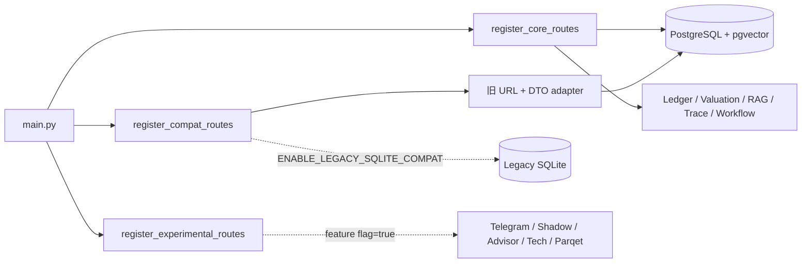

# PortfolioPilot 模块运行边界

本文定义当前增量迁移阶段的运行类别。分类依据是数据事实源、注册入口和依赖方向，不只看目录名称。正式主线可以暂时调用位于 `routes/`、`services/`、`rag/`、`prompts/` 和 `workflows/` 的受治理实现，但不得反向依赖 SQLite 或 `state.portfolio_data` 作为组合事实源。

## 启动视图



默认 production 只允许 PostgreSQL 主线、PostgreSQL-backed 兼容 adapter 和显式开启的实验扩展。`ENABLE_LEGACY_SQLITE_COMPAT=true` 在 production 会使配置校验和 readiness 失败。

## Core

Core 是正式 PostgreSQL 主路径，默认加载：

| 路径/能力 | 职责 | 事实源 |
|---|---|---|
| `app/db` | SQLAlchemy Async models、repositories、session | PostgreSQL |
| `app/domain` | 与 HTTP 解耦的账本/持仓领域结果 | 输入对象 |
| `app/services` | 交易导入、重建、估值、知识入库 | PostgreSQL repositories |
| `app/providers` | 行情与 Embedding provider adapter | 明确 provider/source |
| `app/storage` | Local development / S3-compatible abstraction | Object key + checksum |
| `app/workers` | 独立 Session、锁、run lineage | PostgreSQL |
| `app/api` | health、ledger、market data、evaluation | PostgreSQL services |
| `routes/research.py` | 风险、RAG、结构化分析、回测兼容合同 | PostgreSQL snapshot/evidence |
| `routes/knowledge.py`、`routes/prompts.py`、`routes/workflows.py` | governed research API | PostgreSQL + pgvector |
| `rag/hybrid_retriever.py`、`prompts/`、`workflows/` | 混合检索、Prompt 合同、Workflow 规则 | 持久化治理记录 |

Core 由 `register_core_routes(app)` 注册。核心组合链路不得读取根目录 `database.py`，也不得将 `state.portfolio_data` 当作账本或估值事实源。

## Compatibility

Compatibility 用于保持旧 Dashboard 和迁移工具可用，不得复制一套新的金融计算逻辑。

| 模块 | 当前行为 | 迁移边界 |
|---|---|---|
| `routes/portfolio.py` | 保留 `/api/portfolio`、旧 CSV URL 和 Dashboard 页面 | 组合读取/写入通过 PostgreSQL adapter/service |
| `LegacyPortfolioAdapter` | PostgreSQL valuation 转换为旧 `PortfolioSummary` DTO | 只允许新实现到旧 DTO 的单向适配 |
| `LegacyCsvPortfolioImportService` | 旧持仓快照转为可审计 opening balance generation | PostgreSQL ledger 是落点 |
| `routes/analysis.py`、`routes/analytics.py`、`routes/refresh.py`、`routes/streaming.py` | 旧 URL 与尚未迁完的页面能力 | 可引用旧 state，但不属于 Core 事实源 |
| `database.py` 与 SQLite migration scripts | 旧缓存读取、迁移和一致性校验 | 仅显式兼容模式/CLI |
| `routes/evaluation.py` 等 shim | 保留旧 import 路径 | 只转发，不复制业务逻辑 |

`register_compat_routes(app)` 保持已承诺 URL。HTTP compatibility 与 SQLite storage compatibility 是两个不同概念：PostgreSQL-backed 旧 URL 可以在 `ENABLE_LEGACY_SQLITE_COMPAT=false` 时继续工作；旧 in-memory Demo、SQLite 初始化、`migrate_json_to_sqlite` 和旧历史分析读取受该开关控制。关闭时仍注册的历史 URL 返回稳定的空/不可用响应，不会延迟导入或查询未初始化的 `database.py`。

development/test 如需验证旧库，必须显式设置：

```env
ENABLE_LEGACY_SQLITE_COMPAT=true
```

启用后 SQLite 初始化或迁移失败会中止启动，不会被吞掉后继续报告完整可用。production 禁止启用。

## Experimental

Experimental 不是正式 A 股/美股研究链路依赖，默认不注册 Router，也不加载其重依赖。

| 功能 | Flag | 延迟注册内容 |
|---|---|---|
| Telegram | `ENABLE_TELEGRAM` | webhook、旧 report/digest trigger |
| Shadow Agent | `ENABLE_SHADOW_AGENT` | `/api/shadow-portfolio*` |
| Trade Advisor | `ENABLE_TRADE_ADVISOR` | `/api/advisor/*` |
| Tech Radar / Tech Picks | `ENABLE_TECH_RADAR` | `/api/tech-picks`、`/api/sectors/rotation` |
| Parqet OAuth compatibility | `ENABLE_PARQET` | OAuth 与 Parqet refresh URL |
| Polymarket | `ENABLE_POLYMARKET` | 可选导入/展示语义；当前无独立 Router |

`register_experimental_routes(app)` 在对应 flag 为 `true` 时才执行局部 import。禁用 Telegram、Parqet 或 Shadow 时，默认进程不会 import 它们的 Router；Trade Advisor 和 Tech Radar 的业务模块只在端点实际执行时加载。
Dashboard 同样消费 `/api/app-settings` 的 feature flags；Trade Advisor 导航/内容和 Parqet 操作在 flag 未显式开启或设置读取失败时 fail closed，不会留下指向未注册 Router 的入口。

## 新代码约束

1. 新正式 API 优先放入 `app/api`，通过 `app/services` 与 repository 访问数据。
2. Core 不得新增对 `database.py`、SQLite RAG、`services.refresh` 或 `state.portfolio_data` 的依赖。
3. Compatibility adapter 可以调用 Core；Core 不得调用 Compatibility。
4. Experimental 必须有默认关闭的 flag，并在 Router 注册前判断，不能依靠端点内部返回 404 代替加载控制。
5. 修改分组或 URL 时同步更新 OpenAPI contract、前端 URL 检查和本文。

历史模块的逐文件证据与最早删除版本见 [legacy-migration-map.md](legacy-migration-map.md)。
