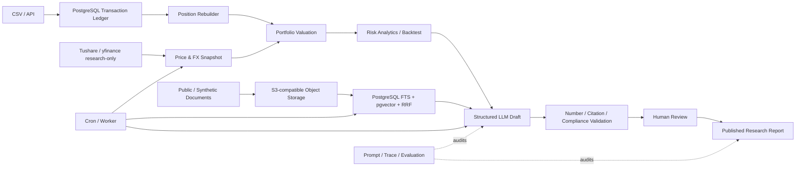

# PortfolioPilot v0.9.0 Release Candidate 验收

## 验收元数据

| 项目 | 值 |
|---|---|
| 验收窗口 | 2026-08-20 06:14-07:08 CST（2026-08-19 22:14-23:08 UTC） |
| 代码候选分支 | `agent/postgres-rag-governance` |
| 已验证代码 SHA | `d8551f94246d836f513bdfeb3e68385de0ab17b4` |
| 对比基线 | `origin/main` |
| 分支关系 | `origin/main` 是候选分支祖先；候选分支 behind 0、ahead 19 |
| Pull Request | PR #2，base `main`，head `agent/postgres-rag-governance`，Draft/Open |
| GitHub Actions | [run 32311152708](https://github.com/xjy0526/PortfolioPilot/actions/runs/32311152708)，全部 required jobs 成功 |
| Python | CI/生产镜像为 Python 3.12；本机旧 venv 为 Python 3.13，仅用于补充检查 |

本文件在上述代码提交之上以文档提交加入。最终合并前仍以当前分支最新 SHA 的
GitHub Actions 结果为准，不把本页的历史快照自动外推到后续业务代码。

## 核心能力

1. **Portfolio Ledger & Valuation**：PostgreSQL transactions 是持仓事实源，支持 CSV
   幂等导入、`as_of` 重放、多币种现金、历史价格/FX 和估值 lineage。
2. **Risk Analytics & Backtest**：确定性风险指标、缺失行情语义、无前视成交约定、
   权重漂移、交易成本、Benchmark 覆盖和回测 provenance。
3. **Governed Hybrid RAG**：对象存储保存原文，PostgreSQL/pgvector 保存版本、Chunk、
   embedding、权限和有效期，并通过全文检索、向量检索及 RRF 融合。
4. **Prompt Registry & LLM Trace**：不可变 Prompt 版本、发布/回滚、结构化输出校验、
   Provider usage/成本和 mock/fallback 明示。
5. **Human-in-the-loop Workflow**：固定节点、工具 allowlist、租约恢复、规则校验、
   服务端审核身份和幂等报告发布。

系统不下真实订单，不提供自动交易，不构成投资建议或收益承诺。

## 技术架构

正式数据库路径使用 SQLAlchemy 2.x Async ORM、asyncpg、PostgreSQL 16、Alembic 和
pgvector。SQLite 只保留在明确标记的 legacy/compatibility 迁移路径中。

## 验证结果

### Required CI

提交 `d8551f94246d836f513bdfeb3e68385de0ab17b4` 的以下 jobs 全部成功：

- Lint, type check, and unit tests
- PostgreSQL integration
- PostgreSQL restart persistence E2E
- Security audit
- Combined coverage report
- Build production container

CI 覆盖率 artifact 的精确结果：

| 范围 | Statements | Missed | Coverage |
|---|---:|---:|---:|
| Total | 26,459 | 9,239 | 65.0818% |
| Core | 6,201 | 926 | 85.0669% |
| Changed production lines | 223 | 5 | 97.7578% |
| Changed core lines | 14 | 0 | 100.0000% |

覆盖率是当前提交的测试观测，不是生产可靠性或模型效果分数。

### 本地质量检查

在同一代码提交上实际执行：

- `ruff check .`：通过。
- `mypy .`：通过，检查 76 个 source files。
- `python -m compileall -q app analytics backtest evaluation prompts rag routes services workflows`：通过。
- `node --check static/app.js`：通过。
- `pip check`：通过；本机 pip cache 权限警告不影响依赖一致性。
- 默认 pytest：`687 passed, 1 deselected, 1 warning in 7.00s`。
- `postgres_restart` 独立 E2E：`1 passed in 23.97s`。
- S3 mock、preflight、production hardening：`19 passed in 0.77s`。
- `git diff --check`：通过。

默认 pytest 中的 1 个 deselected 项是需要 Docker 控制权限的 restart marker，不是 skip；
它由独立 E2E 命令和 required CI job 真实执行。唯一 warning 是 Starlette/httpx 的上游
deprecation warning，未隐藏或改写。

### PostgreSQL 与迁移

- 全新 PostgreSQL/pgvector 数据库从空库 `alembic upgrade head` 成功到
  `20260819_0006`。
- `alembic downgrade -1` 成功回到 `20260813_0005`。
- 再次 `alembic upgrade head` 成功。
- PostgreSQL restart E2E 在真实容器重启后验证交易、持仓、估值、文档、Chunk、
  embedding、Prompt、LLM Trace、Workflow、人工审核和报告 metadata 仍存在，且重放
  不产生重复记录。

### Docker、Compose 与健康检查

- 从干净 clone 的代码 SHA 构建 production target 成功。
- `docker compose config` 与隔离 PostgreSQL smoke 成功。
- production read-only 容器：`/health/live` 返回 200，`/health/ready` 返回 200。
- readiness 实际确认数据库、pgvector `0.8.2`、Alembic head、384 维语义 embedding；
  read-only 模式明确把写对象存储和认证标为 `not_required`。
- 对 `/api/market-data/sync` 的写请求返回 403：
  `This deployment is a read-only demo`。
- production write mode 的 local/S3 约束和 S3 上传、读取、删除、权限由 19 条专项测试覆盖；
  本次没有真实 S3 凭据，因此没有宣称真实 bucket smoke 成功。

## 全新环境 Smoke

使用 `/tmp` 下的干净 clone、独立 PostgreSQL volume、独立对象存储 volume 和独立端口，
没有读取现有业务数据库。最终干净 clone 的 HEAD 为已验证代码 SHA。

实际完成：

1. production 镜像从干净 clone 构建成功。
2. README 的 V2 `synthetic_smoke` quick start 成功：`sample_count=60`、
   `dataset_version=2.0.0`、`mock_response_used=true`、`human_reviewed_count=0`。
3. README 的本地历史 CSV 回测成功，报告标明 `historical_csv`、
   `mock_price_data_used=false` 和 execution convention。
4. 启动 PostgreSQL/pgvector，应用 migration，运行 bootstrap 和 preflight 成功。
5. 导入 `example_transactions.csv`：4 行 accepted、0 rejected；重复文件返回
   `idempotent_replay=true`。
6. yfinance research-only 同步写入 AAPL 历史价格和 USD/CNY 历史 FX。A 股完整估值所需
   的一条价格使用临时 `synthetic_smoke_fixture` source 写入，未伪装为 Tushare 或真实行情，
   也没有写回仓库。
7. 完整估值快照生成成功；风险 API 返回结构化指标、集中度、资产类型暴露和数据质量。
8. multipart 上传公开训练 fixture，Worker 生成 4 个持久化 Chunk/embedding；发布后 RAG
   返回 document/version/chunk ID 和引用。
9. 无 Qwen Key 的 Workflow 草稿明确记录 `source=mock`、`ai_available=false`；数字、引用、
   权限和合规规则通过后进入 `PENDING_REVIEW`。
10. 服务端 development Principal 执行 approve，Worker 将报告发布为 `PUBLISHED`；重复业务
    幂等键返回同一 run/report。
11. 一次性 daily pipeline 完成 market sync + valuation；同日重跑返回
    `idempotent_replay=true` 和相同 run IDs。

Smoke 首次运行发现 fallback 将 `0.9017...` 显示为 `90.2%` 时，数字校验器没有接受正常
舍入，Workflow 因此进入 RETRY。提交 `d8551f9` 只修复百分比显示舍入映射并增加回归测试；
无来源的百分比、未知 ticker、无效引用和不一致 risk score 仍会被拒绝。修复后完整流程通过。

README 的完整开发路径在宿主机使用 `SERVER_PORT=8000`。production Docker 镜像使用
`PORT=8080`，容器 smoke 按镜像入口映射 8080；两者是明确的运行环境差异。

## 评测披露

### Synthetic smoke

`evaluation.run_full_eval` 报告：

- `evaluation_mode=synthetic_smoke`
- `generated_at=2026-08-19T22:58:57.027302+00:00`
- `git_commit_sha=d8551f94246d836f513bdfeb3e68385de0ab17b4`
- `mock_response_used=true`
- `model_provider=deterministic_mock`
- `model_name=portfolio-risk-mock-v1`
- `dataset_name=portfolio_risk_and_retrieval_gold`
- `dataset_version=v1`
- `human_label_used=false`
- `production_data_used=false`
- `real_model_used=false`
- generation cases 20，retrieval cases 8，workflow runs 0

这只证明 deterministic fixture、schema 和规则链路没有明显回归，不能表述为真实 Qwen
准确率、真实检索质量、人工 gold 结果、生产效果或“零幻觉”。

### Live model

`live_model_eval` 在同一 SHA 上显式调用 Qwen，未回退 mock，但 DashScope 对全部请求返回
401 Unauthorized：

- `generated_at=2026-08-19T23:01:10.339138+00:00`
- `evaluation_status=completed_with_case_errors`
- `mock_response_used=false`
- `model_provider=qwen`
- `model_name=qwen-plus`
- `valid_response_case_count=0`
- `human_label_used=false`
- `production_data_used=false`

因此本次没有可对外展示的 live model 质量指标。报告中的 0 值来自无有效响应，不能解释为
模型得分。必须更换有效 Secret 后重新运行，且仍需与 human gold 结果分开披露。

### Human/production

- 没有 approved human labels，本次未运行 `human_gold_eval`。
- 没有生产观测数据，本次未运行 `production_monitoring`。
- 不能对外宣称真实基金公司效果、生产准确率、人工通过率或生产成本。

## 数据与安全披露

- Gitleaks 对当前 Git 历史扫描通过；没有新增 Secret 命中。
- production Python 3.12 镜像的 `pip-audit` 未发现已知漏洞。CPU-only `torch 2.13.0+cpu`
  因不是 PyPI 发行记录而被工具明确列为无法审计，不应误写为已审计通过。
- 本机旧 venv 的一次 pip-audit 曾报告 28 个旧包漏洞；新鲜 CI/生产镜像安装未复现。发布
  依据新鲜 Python 3.12 环境，本地开发者应重建 venv，不应复用旧环境作发布产物。
- 仓库未跟踪 `.env`、私钥、SQLite/DB 文件、对象存储内容或 cache 报告。
- 示例组合和评测数据为自行构造 fixture 或公开材料的项目自写摘要，不含真实个人持仓、
  客户信息、实习单位内部研报或授权受限大规模数据。
- production identity 由服务端 middleware 建立；development identity headers 在 production
  配置中被拒绝。写接口仍需角色和 portfolio/tenant 权限。
- 上传仅允许 txt/md/csv/pdf，并限制为 10 MiB、200 PDF 页、5,000 Chunk 和 60 秒解析超时。
- 核心 LLM/Workflow 日志未发现记录 API Key、密码、Authorization header 或完整 Prompt 的路径。
  默认关闭的 Telegram/Shadow/Trade Advisor legacy 扩展仍有消息摘要、chat ID 或工具参数日志，
  若未来启用，应先完成额外脱敏审计。

## 已知限制

1. live Qwen 凭据当前不可用，真实模型评测未通过。
2. 没有 approved human gold，也没有 production monitoring 数据。
3. 真实 S3-compatible bucket、正式 OIDC/SAML、备份恢复演练和灾备切换未在本机验证。
4. yfinance 仅用于研究演示，没有生产 SLA；A 股生产数据需要有效 Tushare 配置和授权边界。
5. 回测具备 point-in-time 执行和缺失数据约束，但不是完整生产级 walk-forward 平台。
6. Basic Auth、本地 hashing embedding 和 local object storage 只适合本地/演示；生产可写模式
   必须使用正式认证、语义 embedding 和 S3-compatible storage。
7. SQLite、旧 routes/services/fetchers 和实验功能仍有兼容路径，不能在本版本一次性删除。
8. 上游 Starlette/httpx deprecation warning 和 GitHub official actions 的 Node 兼容 warning
   需要后续依赖升级处理。
9. 最新治理链路尚无已提交的完整真实 UI 录屏；旧截图只用于迁移对照。

## 部署要求

### Read-only demo

- Python 3.12 或当前 production image。
- PostgreSQL 16 + pgvector，Alembic revision 必须为 head。
- `READ_ONLY_DEMO=true`；所有 mutation 由 middleware 拒绝。
- 可以不配置写对象存储和 Qwen，但界面/API 必须显示 unavailable、mock 或 synthetic 状态。

### Production write mode

- `ENVIRONMENT=production`、`READ_ONLY_DEMO=false`。
- PostgreSQL/pgvector、迁移、备份和恢复策略。
- `OBJECT_STORAGE_BACKEND=s3` 以及完整 S3-compatible Secret；不允许静默回退 local。
- 正式服务端认证配置，禁止 development identity headers。
- 可用语义 embedding Provider；生产禁止 hashing fallback。
- Qwen/OpenAI-compatible Secret 由 Secret Manager 注入，不能写入 Blueprint 或仓库。
- Web、Cron、ingestion Worker 和 workflow Worker 使用同一数据库和对象存储命名空间。
- 部署前运行 `python -m app.core.preflight`，readiness 失败时不得接流量。

## 从旧 main 迁移

1. 备份旧 SQLite、上传对象和部署环境变量；先在隔离环境演练，不直接覆盖生产数据。
2. 部署 PostgreSQL 16/pgvector，配置 `DATABASE_URL`，执行 `alembic upgrade head`。
3. 使用 `scripts/migrate_sqlite_to_postgres.py` 迁移支持的旧组合快照/交易；旧持仓只能明确
   转成 `opening_balance`，不能宣称完整交易历史。
4. 如存在旧治理库，使用 `scripts/migrate_governance_sqlite_to_postgres.py`，再运行
   `scripts/validate_governance_migration.py` 和检索对比脚本。
5. 配置 security master/provider symbols，按 source/data_as_of 同步历史价格和 FX，再生成
   valuation snapshots。
6. 配置对象存储、embedding、Prompt deployment、Worker/Cron 和生产认证。
7. 先以 read-only 模式验证 health、权限、快照和报告；确认备份后再开启写模式。
8. 保留 legacy adapters 完成前端/API 回归；不要直接删除旧 SQLite 文件或兼容分支。

详细参数以各脚本 `--help`、[部署文档](../deployment.md) 和
[迁移地图](../legacy-migration-map.md) 为准。

## 回滚方式

1. 合并前保留 `main`、PR #1 分支和 PR #2 分支，不改写历史。
2. 应用回滚优先重新部署上一个已验证镜像/SHA；不要用 force push 或 `reset --hard` 改远端。
3. 数据库升级前创建备份。应用回滚通常保留向后兼容的新表/列；只有在备份可恢复且明确
   验证影响后才执行 Alembic downgrade。
4. 对象存储按 version/object key 回滚，数据库 metadata 与对象版本必须一起校验 checksum。
5. 如果新 ledger 快照异常，切回 read-only、停止 Cron/Worker，保留 sync/workflow trace 后调查；
   不把 SQLite 重新设为事实源。
6. 回滚后重新执行 live/ready、核心 pytest、迁移检查和 smoke，不以进程启动代替业务验证。

## 合并后分支处理

本阶段不合并 PR、不关闭 PR、不删除任何分支。合并、打 tag 并完成观察期后，才可评估：

- `agent/institutional-research-platform`：PR #1 若确认被 PR #2 完整覆盖，可在保留 tag/PR
  记录后删除远端分支。
- `agent/postgres-rag-governance`：PR #2 合并、v0.9.0 tag 和回滚引用确认后再删除。
- `main`：保留为默认和发布主线，不删除。

## Go / No-Go

**代码候选进入 `main`：GO。** 理由是 required CI 全部成功、没有未解释 skip、真实 restart
E2E 通过、迁移可升降、干净 clone/README 主路径和 read-only deployment smoke 通过、PR
历史指标有日期/SHA 边界、Secret 扫描通过，且候选分支 behind main 为 0、PR mergeable。

**生产可写发布与真实模型质量宣传：NO-GO。** 在有效 Qwen 凭据、真实 S3 bucket、正式认证、
备份恢复演练和 approved human gold 就绪前，不应开启生产写模式，也不能对外宣称真实模型
准确率或生产效果。
